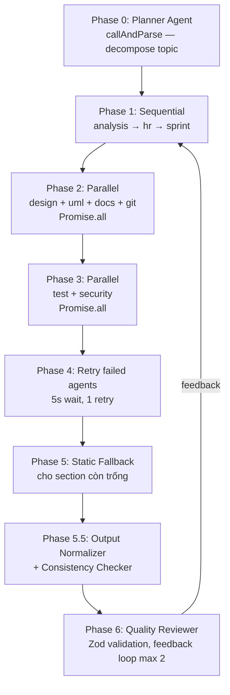
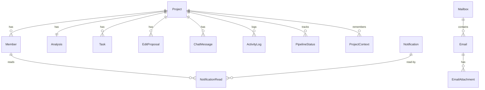

# 📐 NEXUS AI — Kiến trúc hệ thống (v0.2.0)

> **Multi-Agent Project Architect** — System design, kiến trúc AI module hóa, luồng dữ liệu và các quyết định thiết kế.
>
> **Tech stack:** Next.js 16 · React 19 · TypeScript 5 · Prisma 6 (SQLite) · OpenRouter AI · Zustand · Framer Motion 12

---

## 📑 Mục lục

- [Overview](#-overview)
- [High-Level Architecture](#-high-level-architecture)
- [Modular AI Architecture (24 modules)](#-modular-ai-architecture-24-modules)
- [Multi-Agent Pipeline (8 Phases)](#-multi-agent-pipeline-8-phases)
- [OpenRouter Client](#-openrouter-client)
- [callAndParse — Retry Engine](#-callandparse--retry-engine)
- [Database Schema (23 models)](#-database-schema-23-models)
- [Frontend Architecture](#-frontend-architecture)
- [API Design](#-api-design)
- [Mini-Services](#-mini-services)
- [Deployment](#-deployment)
- [Design Decisions](#-design-decisions)

---

## 🎯 Overview

**NEXUS AI** là một hệ thống **đa agent (multi-agent)** đóng vai trò "kiến trúc sư dự án tự động". Khi người dùng nhập một ý tưởng/dự án, hệ thống sẽ:

1. **Phân tách** dự án thành các module (Planner Agent)
2. **Điều phối** 10 agent chuyên biệt để tạo ra 9 section output (analysis, hr, sprint, design, uml, docs, git, test, security)
3. **Tổng hợp** qua Quality Reviewer với Zod validation
4. **Fallback** tĩnh nếu agent lỗi — không bao giờ crash pipeline

### Nguyên tắc cốt lõi

| Nguyên tắc | Triển khai |
|---|---|
| **Modularity** | 24 modules trong 10 thư mục, không god-file |
| **Resilience** | Circuit Breaker + Dead Model + Static Fallback |
| **Local-first** | SQLite + in-memory caches, không cần Postgres/Redis |
| **Async-first** | API trả về ngay, frontend poll progress |
| **Type-safety** | Zod schemas lenient, TypeScript strict |

---

## 🏗 High-Level Architecture

```
┌────────────────────────────────────────────────────────────────────┐
│                         BROWSER (Client)                           │
│  ┌──────────────┐  ┌──────────────┐  ┌──────────────────────────┐  │
│  │  Next.js 16  │  │  Zustand     │  │  13 Workspace Tabs       │  │
│  │  App Router  │  │  (persist)   │  │  (lazy-loaded + Suspense)│  │
│  └──────┬───────┘  └──────────────┘  └──────────────────────────┘  │
└─────────┼──────────────────────────────────────────────────────────┘
          │ HTTP /fetch
┌─────────▼──────────────────────────────────────────────────────────┐
│              Next.js API Routes (42 files / ~58 endpoints)          │
│   ┌────────────┐ ┌────────────┐ ┌────────────┐ ┌────────────────┐   │
│   │ /projects  │ │ /initialize│ │ /refine    │ │ /progress      │   │
│   │ /tasks     │ │ /chat      │ │ /members   │ │ /mailbox       │   │
│   └─────┬──────┘ └─────┬──────┘ └─────┬──────┘ └───────┬────────┘   │
│         │              │              │                │            │
│         └──────────────┴──────┬───────┴────────────────┘            │
│                               │                                     │
│   process.nextTick(() => runWithProjectLog(id, () => runPipeline))  │
└───────────────────────────────┼─────────────────────────────────────┘
                                │
┌───────────────────────────────▼─────────────────────────────────────┐
│                  AI Pipeline (src/lib/ai — 24 modules)              │
│  ┌─────────┐ ┌──────────┐ ┌─────────┐ ┌─────────┐ ┌────────────┐    │
│  │pipeline │ │  agents  │ │ prompts │ │ config  │ │  contracts │    │
│  │(8 files)│ │          │ │         │ │         │ │ + plugins  │    │
│  └────┬────┘ └──────────┘ └─────────┘ └─────────┘ └────────────┘    │
│       │                                                             │
│  ┌────▼────────────────────────────────────────────────────────┐    │
│  │  core/ (EventBus, Workflow DSL)                              │    │
│  │  memory/ (Shared Memory + Retrieval Agent)                   │    │
│  │  cache/ (Semantic Cache — cosine similarity)                 │    │
│  │  queue/ (Distributed Task Queue + worker pool)               │    │
│  │  utils/ (helpers, jfix, diff, versionManager, dependency)    │    │
│  └──────────────────────────────────────────────────────────────┘    │
└───────────────────────────────┬─────────────────────────────────────┘
                                │ HTTPS (multi-key rotation)
┌───────────────────────────────▼─────────────────────────────────────┐
│              OpenRouter API (openrouter.ai)                          │
│   10 core models · 5 plugin models · circuit breaker + dead model   │
└─────────────────────────────────────────────────────────────────────┘
                                │
┌───────────────────────────────▼─────────────────────────────────────┐
│           SQLite (Prisma 6 — 23 models)                             │
│   Project · Member · Task · Analysis · AgentStatus · PipelineStatus │
└─────────────────────────────────────────────────────────────────────┘
```

---

## 🧩 Modular AI Architecture (24 modules)

Hệ thống AI được tách thành **24 modules** trong **10 thư mục** dưới `src/lib/ai/`. File `src/lib/ai.ts` chỉ là **hub mỏng (70 dòng)** — chỉ re-export, không chứa logic.

```ts
// src/lib/ai.ts — hub mỏng, chỉ re-export
export * from "./ai/pipeline";
export * from "./ai/agents/definitions";
export * from "./ai/prompts";
export * from "./ai/config/constants";
export * from "./ai/openrouter";  // legacy alias
// ... 70 dòng tổng cộng, không logic
```

### Cây thư mục

```
src/lib/ai/
├── config/
│   └── constants.ts          # 50 dòng — timeouts, retries, getAdaptiveTimeout
├── prompts/
│   └── index.ts              # 275 dòng — 10 agent prompts + TASK_GEN_PROMPT
├── agents/
│   └── definitions.ts        # 121 dòng — AgentDef[] + REVIEWER/TASK_GEN/CHAT_MODELS
├── pipeline/                 # 8 files — trái tim hệ thống
│   ├── index.ts              # 220 dòng — runPipeline orchestrator (8 phases)
│   ├── runner.ts             # 170 dòng — callModel + callAndParse, retry engine
│   ├── fallback.ts           # 287 dòng — static fallback cho 9 sections
│   ├── taskGen.ts            # 165 dòng — generateTasks (dedup) + chatAssistant
│   ├── refine.ts             # 63 dòng  — AI Refine sections
│   ├── reflection.ts         # 139 dòng — Reflection Agent (quality review)
│   ├── dag.ts                # 171 dòng — DAG Workflow Engine
│   └── consensus.ts          # 152 dòng — Multi-Reviewer Consensus
├── utils/                    # 5 files
│   ├── helpers.ts            # tiện ích chung
│   ├── jfix.ts               # JSON repair (markdown fences, trailing commas)
│   ├── diff.ts               # diff text cho version manager
│   ├── versionManager.ts     # versioning output qua các lần refine
│   └── dependencyAnalyzer.ts # phân tích dependency giữa tasks
├── contracts/
│   ├── agent.ts              # AgentContract interface
│   └── registry.ts           # AgentRegistry singleton
├── plugins/
│   └── index.ts              # registerAllPlugins — 15 agents (10 core + 5 plugin)
├── core/
│   ├── eventBus.ts           # EventBus extends EventEmitter
│   └── workflow.ts           # Workflow DSL (declarative)
├── memory/
│   └── memoryService.ts      # Shared Memory + Memory Agent + Retrieval Agent
├── cache/
│   └── semanticCache.ts      # cosine similarity, threshold 0.85, no Vector DB
└── queue/
    └── taskQueue.ts          # Distributed Queue + worker pool + dead letter
```

### Agent Definitions

```ts
// src/lib/ai/agents/definitions.ts (rút gọn)
export interface AgentDef {
  id: string;
  name: string;
  key: SectionKey;              // field trong Project.analysis
  models: string[];             // fallback chain
  temperature: number;
  required: boolean;
}

export const AGENTS: AgentDef[] = [
  { id: "planner",   name: "Planner",          key: "analysis", models: [...], temp: 0.3, required: true },
  { id: "analyst",   name: "Business Analyst", key: "analysis", models: [...], temp: 0.4, required: true },
  { id: "hr",        name: "HR Manager",       key: "hr",       models: [...], temp: 0.4, required: true },
  { id: "scrum",     name: "Scrum Master",     key: "sprint",   models: [...], temp: 0.5, required: true },
  { id: "architect", name: "Architect",        key: "design",   models: [...], temp: 0.5, required: true },
  { id: "uml",       name: "UML Designer",     key: "uml",      models: [...], temp: 0.4, required: true },
  { id: "docs",      name: "Tech Writer",      key: "docs",     models: [...], temp: 0.4, required: true },
  { id: "gitops",    name: "GitOps",           key: "git",      models: [...], temp: 0.3, required: true },
  { id: "qa",        name: "QA Engineer",      key: "test",     models: [...], temp: 0.5, required: true },
  { id: "security",  name: "Security Auditor", key: "security", models: [...], temp: 0.4, required: true },
];

export const REVIEWER_MODELS  = [...];  // cho reflection/consensus
export const TASK_GEN_MODELS  = [...];  // cho generateTasks
export const CHAT_MODELS      = [...];  // cho chatAssistant
export const MIN_KEYS         = 1;      // ít nhất 1 OpenRouter key
```

### Config Constants

```ts
// src/lib/ai/config/constants.ts
export const MAX_RETRIES         = 5;       // retry per model trong callAndParse
export const MAX_CONCURRENCY     = 3;       // pLimit cho parallel agents
export const DEFAULT_TIMEOUT     = 60_000;  // 60s mỗi call
export const RATE_LIMIT_COOLDOWN = 60_000;  // key 429 → 60s
export const DEAD_MODEL_COOLDOWN = 120_000; // 2 min
export const CB_OPEN_DURATION    = 180_000; // 3 min circuit breaker
export const CB_FAILURE_THRESHOLD = 3;      // 3 consecutive failures → open
export const CACHE_TTL           = 3_600_000; // 1h
export const CACHE_MAX_ENTRIES   = 100;
export const compressContext     = (s: string) => /* truncate + summarize */;

export function getAdaptiveTimeout(promptLen: number): number {
  // prompt dài → timeout dài hơn (max 180s)
  return Math.min(DEFAULT_TIMEOUT + promptLen * 0.5, 180_000);
}
```

---

## ⚙️ Multi-Agent Pipeline (8 Phases)

Pipeline chính nằm trong `src/lib/ai/pipeline/index.ts` (`runPipeline`, 220 dòng). Nó điều phối 10 agents qua 8 phases:



### Chi tiết từng phase

| Phase | Mô tả | Triển khai |
|---|---|---|
| **0** | Planner decompose topic thành modules | `callAndParse(plannerAgent, ...)` |
| **1** | Sequential: analysis → hr → sprint (mỗi cái phụ thuộc cái trước) | `await` chuỗi |
| **2** | Parallel: design + uml + docs + git | `Promise.all([...])` |
| **3** | Parallel: test + security | `Promise.all([...])` |
| **4** | Retry các agent thất bại (5s wait giữa, 1 retry) | loop qua `failed[]` |
| **5** | Static fallback cho section còn trống — không crash | `fallback.ts` (287 dòng) |
| **5.5** | Output Normalizer + Consistency Checker | xem bên dưới |
| **6** | Quality Reviewer — merge + Zod validation + feedback loop (max 2 rounds) | `reflection.ts` |

### Phase 5.5 — Output Normalizer + Consistency Checker

```ts
// Phase 5.5: làm sạch output trước khi review
function normalizeOutput(raw: ProjectOutput): ProjectOutput {
  return {
    ...raw,
    analysis: trimAndCollapse(raw.analysis),      // strip \0, collapse whitespace
    hr: {
      ...raw.hr,
      assignments: dedupArray(raw.hr.assignments), // dedup by name
    },
    sprint: {
      ...raw.sprint,
      sprints: raw.sprint.sprints.map(dedupTasks),
    },
  };
}

// Consistency Checker: HR.assignments.name phải khớp input.members
function checkConsistency(output: ProjectOutput, input: ProjectInput) {
  const assignedNames = new Set(output.hr.assignments.map(a => a.name));
  const memberNames   = new Set(input.members.map(m => m.name));
  const orphans = [...assignedNames].filter(n => !memberNames.has(n));
  if (orphans.length) {
    // log warning + tự sửa: map về member gần nhất
    fixOrphanAssignments(output, orphans, input.members);
  }
}
```

### Phase 6 — Quality Reviewer với feedback loop

```ts
// src/lib/ai/pipeline/reflection.ts (rút gọn)
export async function qualityReview(
  output: ProjectOutput,
  input: ProjectInput,
  maxRounds = 2
): Promise<ProjectOutput> {
  let current = output;
  for (let round = 0; round < maxRounds; round++) {
    const review = await callAndParse(REVIEWER_MODELS, buildReviewPrompt(current));
    const issues = validateSection(current); // Zod
    if (issues.length === 0 && review.score >= 0.8) break;
    current = await applyFeedback(current, review.feedback); // refine
  }
  return current;
}
```

---

## 🔌 OpenRouter Client

File `src/lib/openrouter.ts` (548 dòng) là lớp giao tiếp với OpenRouter API, tích hợp nhiều cơ chế resilience:

### Tính năng chính

| Tính năng | Mô tả |
|---|---|
| **Multi-key rotation** | Đọc `OPENROUTER_API_KEY`, `_2`, `_3`, ... lên tới **100 keys** |
| **Rate-limit cooldown** | `markKeyRateLimited(idx, retryAfter)` → 60s cooldown |
| **Dead Model cache** | `deadModels` Map, 2 min cooldown, auto-recovery |
| **Circuit Breaker** | 3 consecutive failures → open 3 min, half-open sau cooldown |
| **Health Score** | `getModelHealth(model)` — successRate, totalCalls, avgLatency |
| **Prompt cache** | `aiCache` Map, 1h TTL, max 100 entries, chỉ cache temp < 0.5 |
| **Structured Outputs** | `response_format: { type: "json_object" }` |
| **Response healing** | `plugins: [{ id: "response-healing" }]` — auto-strip markdown fences |

### Sơ đồ key rotation + circuit breaker

```
callOpenRouterDirect(params, timeoutMs)
        │
        ▼
┌───────────────────────────┐
│ getAvailableKeyIndex()    │── skip rate-limited keys (60s cooldown)
└───────────┬───────────────┘
            │
            ▼
┌───────────────────────────┐    NO  ┌─────────────────────┐
│  for each key (max 100):  │──────▶│  return 429 error   │
│  - check circuit breaker  │       │  (mark key limited) │
│  - check dead model cache │       └─────────────────────┘
└───────────┬───────────────┘
            │ YES (key available)
            ▼
┌───────────────────────────┐
│  fetch(openrouter.ai/...) │
│  handle: 429/401/403/404  │── markKeyRateLimited / markDeadModel
│  handle: 5xx, ETIMEDOUT   │── circuitBreaker.recordFailure
└───────────┬───────────────┘
            │ success
            ▼
   updateHealthScore(model)
   cacheIfEligible(prompt, response)
   return data
```

### Ví dụ code

```ts
// src/lib/openrouter.ts (rút gọn)
const aiCache = new Map<string, { value: any; expires: number }>();
const deadModels = new Map<string, number>();   // model → expiry timestamp
const circuitBreakers = new Map<string, CBState>();

export async function callOpenRouterDirect(
  params: OpenRouterParams,
  timeoutMs = DEFAULT_TIMEOUT
): Promise<any> {
  // 1. Check prompt cache (chỉ temp < 0.5)
  if (params.temperature < 0.5) {
    const cached = aiCache.get(hashPrompt(params));
    if (cached && cached.expires > Date.now()) return cached.value;
  }

  // 2. Skip dead models
  if (isDeadModel(params.model)) {
    throw new Error(`Model ${params.model} is dead, skip`);
  }

  // 3. Check circuit breaker
  const cb = getCircuitBreaker(params.model);
  if (cb.state === "open" && cb.openUntil > Date.now()) {
    throw new Error(`Circuit open for ${params.model}`);
  }

  // 4. Try all keys
  let consecutiveTimeouts = 0;
  for (let attempt = 0; attempt < 100; attempt++) {
    const keyIdx = getAvailableKeyIndex();
    if (keyIdx === -1) throw new Error("No available keys");

    try {
      const res = await fetchWithTimeout("https://openrouter.ai/api/v1/chat/completions", {
        method: "POST",
        headers: {
          Authorization: `Bearer ${process.env[`OPENROUTER_API_KEY${keyIdx === 0 ? "" : `_${keyIdx + 1}`}`]}`,
          "Content-Type": "application/json",
        },
        body: JSON.stringify({
          ...params,
          response_format: { type: "json_object" },
          plugins: [{ id: "response-healing" }],
        }),
        signal: AbortSignal.timeout(timeoutMs),
      });

      if (res.status === 429) {
        const retryAfter = parseInt(res.headers.get("retry-after") || "60");
        markKeyRateLimited(keyIdx, retryAfter);
        continue;
      }
      if (res.status === 401 || res.status === 403) { markKeyBad(keyIdx); continue; }
      if (res.status === 404) { markDeadModel(params.model); throw new Error("Model not found"); }
      if (res.status >= 500) { recordCircuitFailure(params.model); continue; }

      const data = await res.json();
      recordSuccess(params.model, Date.now() - startTime);
      cacheIfEligible(params, data);
      return data;
    } catch (err) {
      if (err.name === "AbortError" && ++consecutiveTimeouts >= 2) {
        markDeadModel(params.model);
        throw err;
      }
    }
  }
  throw new Error("All keys exhausted");
}
```

---

## 🔄 callAndParse — Retry Engine

`src/lib/ai/pipeline/runner.ts` (170 dòng) chứa `callModel` và `callAndParse` — trái tim của retry engine.

### Pipeline parse

```
AI response (raw string)
    │
    ▼
┌─────────────────┐
│ 1. JSON.parse   │── fail? ─┐
└────────┬────────┘          │
         │ success           │
         ▼                   │
┌─────────────────┐          │
│ 2. JFix.fix     │◀─────────┘  (strip markdown fences, fix trailing commas,
└────────┬────────┘             fix unquoted keys, etc.)
         │
         ▼
┌─────────────────┐
│ 3. extract      │── fail? ─→ 4. AI self-fix pass (gọi AI sửa JSON)
│    substring    │              │
└────────┬────────┘              │
         │ success               │
         ▼                       │
┌─────────────────┐              │
│ 5. Zod validate │◀─────────────┘
│    (lenient)    │
└────────┬────────┘
         │
         ▼
┌─────────────────┐
│ 6. Self-critic  │── reject if dataStr.length < 20
│                 │            || dataStr === "{}"
│                 │            || dataStr === "[]"
└────────┬────────┘
         │ accept
         ▼
   return parsed
```

### Đặc điểm retry

- **5 retries per model** (`MAX_RETRIES = 5`)
- **Priority sort models** theo health score (successRate cao → ưu tiên)
- **Skip dead models** (nằm trong `deadModels` Map)
- **Concurrency limiter** — `pLimit(MAX_CONCURRENCY = 3)` để không quá tải OpenRouter
- **Full-jitter backoff** — tránh thundering herd

```ts
// src/lib/ai/pipeline/runner.ts (rút gọn)
export async function callAndParse<T>(
  models: string[],
  prompt: string,
  schema: ZodSchema<T>,
  opts: CallOpts = {}
): Promise<T> {
  const sortedModels = models
    .filter(m => !isDeadModel(m))
    .sort((a, b) => getModelHealth(b).successRate - getModelHealth(a).successRate);

  for (const model of sortedModels) {
    for (let attempt = 0; attempt < MAX_RETRIES; attempt++) {
      try {
        const raw = await pLimit(() => callModel(model, prompt, opts));
        const data = parsePipeline(raw, schema);  // JSON.parse → JFix → extract → self-fix
        const validated = schema.validate(data);
        selfCritic(validated);                    // reject empty
        return validated;
      } catch (err) {
        await sleep(fullJitterBackoff(attempt));  // exponential + jitter
      }
    }
  }
  throw new Error("All models exhausted");
}
```

---

## 🗄 Database Schema (23 models)

Prisma 6 + SQLite. Tất cả 23 models nằm trong `prisma/schema.prisma`, nhóm theo feature:

### Core (6 models)

```prisma
model Project {
  id          String   @id @default(cuid())
  title       String
  description String
  topic       String?
  members     Member[]
  analysis    Analysis?
  tasks       Task[]
  editProposals EditProposal[]
  chatMessages ChatMessage[]
  status      String   @default("draft")  // draft|analyzing|ready|error
  token       String?  // access token cho share
  createdAt   DateTime @default(now())
  updatedAt   DateTime @updatedAt
}

model Member {
  id        String  @id @default(cuid())
  projectId String
  project   Project @relation(fields: [projectId], references: [id], onDelete: Cascade)
  name      String
  role      String
  email     String?
  skills    String  // JSON string
}

model Analysis {
  id          String  @id @default(cuid())
  projectId   String  @unique
  project     Project @relation(fields: [projectId], references: [id], onDelete: Cascade)
  data        String  // JSON: 9 sections
  version     Int     @default(1)
}

model Task { /* ... */ }
model EditProposal { /* ... */ }
model ChatMessage { /* ... */ }
```

### Logging (4 models)
`ActivityLog`, `TaskLog`, `TokenLog`, `EmailLog` — theo dõi mọi activity, token usage, mail gửi.

### Monitoring (4 models)
`AgentStatus`, `SystemStatus`, `PipelineStatus`, `TaskStatistic` — real-time health của agents và pipeline.

### Notifications (2 models)
`Notification`, `NotificationRead` — broadcast notifications với read tracking per user.

### Mail (4 models)
`Email`, `EmailAttachment`, `Mailbox`, `MailRead` — mail system cho mỗi project.

### Config (3 models)
`AgentConfig` (override model/temp per agent), `Template` (project templates), `ProjectContext` (long-term memory per project).



---

## 🎨 Frontend Architecture

### 5 Views chính

| Route | View | Mô tả |
|---|---|---|
| `/` | **Home** | Dashboard — stats, recent projects, system status |
| `/input` | **Input** | Form tạo project (multi-step wizard) |
| `/workspace/[id]` | **Workspace** | 13 tabs, lazy-loaded |
| `/projects` | **AllProjects** | List/grid tất cả projects |
| `/agents` | **AgentHub** | Quản lý 15 agents (10 core + 5 plugin) |

### 13 Workspace Tabs

```
Workspace
├── Analysis   (Business Analyst output)
├── HR         (HR Manager assignments)
├── Sprint     (Scrum Master sprint plan)
├── Design     (Architect tech stack)
├── UML        (Mermaid diagrams)
├── Docs       (Tech Writer markdown)
├── Git        (GitOps branching strategy)
├── Chat       (AI chat assistant)
├── Members    (CRUD members)
├── Tasks      (task board + DAG view)
├── Mailbox    (mail system)
├── History    (version timeline)
└── AgentHub   (agent configs)
```

Mỗi tab **lazy-loaded** với `React.lazy` + `Suspense` + `LoadingState` skeleton → bundle ban đầu nhỏ.

### State Management

```ts
// src/store/useNexus.ts
import { create } from "zustand";
import { persist } from "zustand/middleware";

interface NexusState {
  // input form
  projectTitle: string;
  projectDescription: string;
  members: Member[];
  // navigation
  currentRoute: string;
  // actions
  setProjectTitle: (s: string) => void;
  addMember: (m: Member) => void;
  // ...
}

export const useNexus = create<NexusState>()(
  persist(
    (set) => ({
      projectTitle: "",
      // ...
      setProjectTitle: (s) => set({ projectTitle: s }),
    }),
    { name: "nexus-store" }  // localStorage persist
  )
);
```

### Error Handling & Loading

```tsx
// app/layout.tsx (rút gọn)
<html>
  <body>
    <ErrorBoundary>           {/* React class — catch render errors */}
      <NotificationProvider>  {/* Sonner toast với typed notify() API */}
        <NeuralBackground />  {/* sci-fi canvas animation */}
        {children}
      </NotificationProvider>
    </ErrorBoundary>
    {/* Mermaid 11 loaded via CDN */}
    <Script src="https://cdn.jsdelivr.net/npm/mermaid@11/dist/mermaid.min.js" />
  </body>
</html>
```

**App Router special files:**
- `error.tsx` — route-level error UI
- `global-error.tsx` — root error UI (replace layout)
- `loading.tsx` — route-level loading skeleton
- `not-found.tsx` — 404 page

### Reusable State Components

```tsx
<EmptyState  icon="📊" title="Chưa có dữ liệu" hint="Tạo project để bắt đầu" />
<RetryState  onRetry={() => refetch()} error={error} />
<LoadingState variant="cards" />   {/* 4 skeleton variants: cards|list|table|dashboard */}
```

---

## 🌐 API Design

42 route files (~58 HTTP endpoints) trong `src/app/api/`. **Mọi route** đều có:

```ts
// src/app/api/projects/route.ts (pattern chung)
export const dynamic = "force-dynamic";  // luôn server-render
export const runtime = "nodejs";          // không Edge runtime (cần Prisma + Node APIs)

export async function POST(req: Request) {
  const body = await req.json();
  const project = await prisma.project.create({ data: body });

  // Background processing — API trả về ngay
  process.nextTick(() => {
    runWithProjectLog(project.id, () => runPipeline(project));
  });

  return Response.json({ id: project.id, status: "processing" });
}
```

### Access Control

```ts
// src/lib/access.ts
export async function resolveAccess(projectId: string, token?: string) {
  const project = await prisma.project.findUnique({ where: { id: projectId } });
  if (!project) throw new HttpError(404);
  const isMember = /* check */;
  const isLeader = /* check */;
  const hasToken = token && project.token === token;
  return { project, isMember, isLeader, hasToken };
}

export function requireLeader(access: Access) {
  if (!access.isLeader) throw new HttpError(403, "Leader only");
}
```

### AsyncLocalStorage cho Log Routing

```ts
// src/lib/als.ts
import { AsyncLocalStorage } from "async_hooks";

interface LogContext {
  projectId: string;
  phase: "pipeline" | "init" | "refine";
}

export const logStorage = new AsyncLocalStorage<LogContext>();

// Usage trong API route
runWithProjectLog(id, () => runPipeline(project));

// Trong deep callee (bất kỳ depth nào):
export function appendLog(level: string, msg: string) {
  const ctx = logStorage.getStore();
  if (!ctx) return;  // không có context → skip
  prisma.activityLog.create({
    data: { projectId: ctx.projectId, phase: ctx.phase, level, message: msg }
  });
}
```

→ Deep callees (trong `pipeline/runner.ts`, `openrouter.ts`, ...) có thể `appendLog()` mà không cần truyền `projectId` qua nhiều lớp.

### Polling Endpoints

| Endpoint | Mô tả |
|---|---|
| `GET /api/projects/[id]/progress` | Trạng thái pipeline (phase hiện tại, % agents done) |
| `GET /api/projects/[id]/initialize/progress` | Tiến độ init (task generation) |
| `GET /api/projects/[id]/refine/progress` | Tiến độ AI Refine |

Frontend poll mỗi 2s khi status = `analyzing`/`refining`.

---

## 🛰 Mini-Services

Ngoài Next.js main app, hệ thống có 2 mini-service riêng chạy song song:

### chat-service (port 3001)

```ts
// chat-service/index.ts (rút gọn)
import { Server } from "socket.io";
const io = new Server(3001, { cors: { origin: "*" } });

io.on("connection", (socket) => {
  socket.on("join:project", (projectId) => socket.join(`project:${projectId}`));
  socket.on("chat:message", ({ projectId, msg }) => {
    io.to(`project:${projectId}`).emit("chat:message", msg);
    // persist to ChatMessage table
  });
});
```

### notification-service (port 3002)

Broadcast notifications realtime tới tất cả clients subscribed:

```ts
// notification-service/index.ts
const io = new Server(3002, { cors: { origin: "*" } });

io.on("connection", (socket) => {
  socket.on("subscribe:user", (userId) => socket.join(`user:${userId}`));
});

// Khi có notification mới (từ main app qua HTTP POST):
app.post("/broadcast", (req, res) => {
  const { userId, notification } = req.body;
  io.to(`user:${userId}`).emit("notification:new", notification);
  res.json({ ok: true });
});
```

---

## 🚢 Deployment

### Docker

```dockerfile
# Dockerfile (main — standalone Next.js)
FROM node:20-alpine AS builder
WORKDIR /app
COPY package*.json ./
RUN npm ci
COPY . .
RUN npx prisma generate && npm run build

FROM node:20-alpine
WORKDIR /app
ENV NODE_ENV=production
COPY --from=builder /app/.next/standalone ./
COPY --from=builder /app/.next/static ./.next/static
COPY --from=builder /app/prisma ./prisma
EXPOSE 3000
CMD ["node", "server.js"]
```

```dockerfile
# Dockerfile.chat — chat-service riêng (nhẹ hơn, không cần Prisma)
FROM node:20-alpine
WORKDIR /app
COPY chat-service/ .
RUN npm ci --omit=dev
EXPOSE 3001
CMD ["node", "index.js"]
```

### Fly.io

```toml
# fly.toml (main app)
app = "nexus-ai"
primary_region = "sin"
[build]
  dockerfile = "Dockerfile"
[http_service]
  internal_port = 3000
  auto_stop_machines = true
  auto_start_machines = true
  min_machines_running = 0
[[vm]]
  memory = "1gb"
  cpu_kind = "shared"
  cpus = 1
```

```toml
# fly.chat.toml (chat-service)
app = "nexus-ai-chat"
primary_region = "sin"
[build]
  dockerfile = "Dockerfile.chat"
[http_service]
  internal_port = 3001
```

### Caddy (Reverse Proxy + Gateway)

```Caddyfile
# Caddyfile
nexus.example.com {
    # Main app
    reverse_proxy localhost:3000

    # Chat service (Socket.io — cần upgrade)
    @chat path /socket.io/*
    handle @chat {
        reverse_proxy localhost:3001 {
            header_up XTransformPort "3001"
        }
    }

    # Notification service
    @notif path /notifications/*
    handle @notif {
        reverse_proxy localhost:3002
    }
}
```

### Tunnel (dev/expose)

`tunnel.conf` hỗ trợ 3 mode:

| Mode | Lệnh | Use case |
|---|---|---|
| `quick` | `cloudflared tunnel --url localhost:3000` | Test nhanh |
| `cloudflare-named` | `cloudflared tunnel run nexus` | Production stable |
| `ngrok` | `ngrok http 3000` | Demo cho client |

---

## 🧠 Design Decisions

10 quyết định thiết kế quan trọng nhất, kèm lý do:

### 1. Modular AI (24 modules) thay vì god-file

**Vì sao:** File `ai.ts` cũ từng >3000 dòng, khó maintain, khó test, conflict Git liên tục.
**Giải pháp:** Tách thành 24 modules trong 10 thư mục, mỗi module **single responsibility**. Hub `ai.ts` chỉ 70 dòng re-export.

### 2. OpenRouter multi-key rotation

**Vì sao:** Free tier OpenRouter rate-limit gắt (40 req/min). Một key duy nhất dễ 429.
**Giải pháp:** Hỗ trợ tới 100 keys (`OPENROUTER_API_KEY`, `_2`, ..., `_100`), `getAvailableKeyIndex()` skip keys đang cooldown 60s.

```ts
// .env
OPENROUTER_API_KEY=sk-or-v1-xxx
OPENROUTER_API_KEY_2=sk-or-v1-yyy
OPENROUTER_API_KEY_3=sk-or-v1-zzz
# ... up to _100
```

### 3. Circuit Breaker + Dead Model — skip failing models nhanh

**Vì sao:** Khi một model sập (503/timeout), retry liên tục tốn token + thời gian.
**Giải pháp:**
- **Circuit Breaker** — 3 consecutive failures → open 3 min, half-open sau cooldown
- **Dead Model cache** — model 404 hoặc timeout 2 lần liên → dead 2 min, auto-recovery

### 4. Zod lenient schemas

**Vì sao:** AI output không deterministic — đôi khi trả `"3"` thay vì `3`, `["a"]` thay vì `"a"`.
**Giải pháp:** Preprocessors `toString`, `toStringArray`, `toNumber` coerce kiểu trước khi validate:

```ts
const AnalysisSchema = z.object({
  summary: z.preprocess(toString, z.string()),
  risks: z.preprocess(toStringArray, z.array(z.string())),
  confidence: z.preprocess(toNumber, z.number().min(0).max(1)),
});
```

### 5. Static fallback data — pipeline không bao giờ crash

**Vì sao:** AI có thể fail hoàn toàn (hết keys, hết model). Không được trả 500 cho user.
**Giải pháp:** `fallback.ts` (287 dòng) có generator tĩnh cho từng section. Nếu agent fail sau retry + circuit breaker → fill fallback → user vẫn có output (kèm flag `isFallback: true`).

### 6. SQLite (không Postgres)

**Vì sao:** Local-first, zero-config, không cần external DB. Đủ cho single-instance deployment.
**Giải pháp:** Prisma 6 + SQLite (`file:./prisma/dev.db`). Backup = copy file. Migrate = `prisma migrate dev`.

### 7. In-memory caches (không Redis)

**Vì sao:** Không cần distributed cache cho single-instance. Redis là overhead không cần thiết.
**Giải pháp:** 3 in-memory caches:
- **Semantic Cache** (`cache/semanticCache.ts`) — cosine similarity giữa prompts, threshold **0.85**, không cần Vector DB
- **Prompt Cache** (`aiCache` Map, 1h TTL, 100 entries) — exact match, chỉ temp < 0.5
- **Dead Model Cache** (`deadModels` Map, 2 min cooldown)

### 8. AsyncLocalStorage cho log routing

**Vì sao:** Mọi log cần gắn `projectId` để query được, nhưng truyền `projectId` qua 5-10 lớp hàm rất xấu.
**Giải pháp:** `AsyncLocalStorage<LogContext>` — set context ở API route, deep callees `appendLog()` lấy context từ store.

### 9. Background processing (process.nextTick)

**Vì sao:** Pipeline chạy 30s-3phút. Không thể giữ HTTP request mở lâu.
**Giải pháp:** API route `POST /projects` → `prisma.create` → `process.nextTick(() => runPipeline(...))` → return `{ id, status: "processing" }` ngay. Frontend poll `GET /progress` mỗi 2s.

### 10. Lazy-loaded tabs

**Vì sao:** Workspace có 13 tabs, mỗi tab có thể nặng (Mermaid, Monaco editor, charts). Load hết ban đầu = bundle 5MB+.
**Giải pháp:** `React.lazy(() => import("./AnalysisTab"))` + `<Suspense fallback={<LoadingState variant="cards" />}>`. Tab nào không mở không load.

### 11. Framer Motion 12 — animations

**Vì sao:** UX mượt mà, micro-interactions, page transitions. API declarative, dễ dùng với React 19.

### 12. Sonner toast — notification system

**Vì sao:** Toast hiện đại, accessible, nhỏ gọn (3KB). Hỗ trợ stacking, swipe-to-dismiss, custom styling.
**Wrap trong `NotificationProvider`** với typed `notify()` API:

```ts
notify.success("Project đã tạo");
notify.error("Pipeline lỗi", { description: err.message });
notify.promise(fetchData, { loading: "Đang tải...", success: "Xong!", error: "Lỗi" });
```

---

## 📊 Tóm tắt kỹ thuật

| Khía cạnh | Con số |
|---|---|
| AI modules | 24 (trong 10 thư mục) |
| Agents | 15 (10 core + 5 plugin) |
| Pipeline phases | 8 (0→6, có 5.5) |
| Prisma models | 23 |
| API routes | 42 files / ~58 endpoints |
| Workspace tabs | 13 (lazy-loaded) |
| Frontend views | 5 |
| OpenRouter keys | lên tới 100 |
| Max retries per model | 5 |
| Concurrency limit | 3 |
| Cache TTL | 1h (prompt), 2min (dead model), 3min (circuit breaker) |

---

> **Phiên bản tài liệu:** v0.2.0 · **Cập nhật:** 2025 · **Trạng thái:** Verified against codebase
