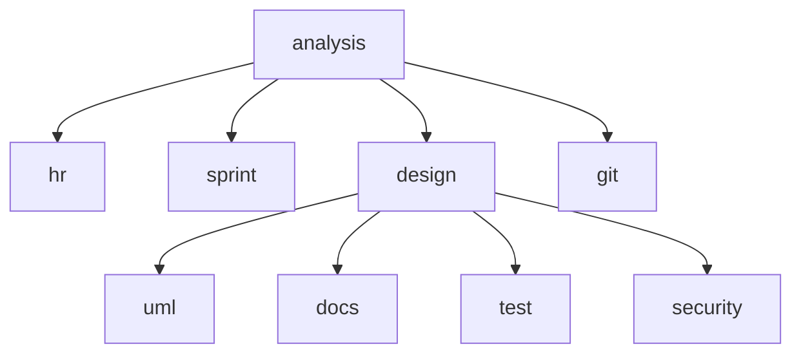

# 📐 NEXUS AI — Architecture (v6.0 Modular)

> System design, **24-module AI structure**, data flow, **36 enterprise features**, và design decisions.

## 📑 Mục lục

- [Overview](#-overview)
- [High-Level Architecture](#-high-level-architecture)
- [24-Module AI Structure](#-24-module-ai-structure)
- [Multi-Agent Pipeline (8 Phases)](#-multi-agent-pipeline-8-phases)
- [36 Enterprise Features](#-36-enterprise-features)
- [Agent Contract + Plugin System](#-agent-contract--plugin-system)
- [DAG Workflow Engine](#-dag-workflow-engine)
- [Workflow DSL](#-workflow-dsl)
- [Event Bus](#-event-bus)
- [Shared Memory (Memory Agent + Retrieval Agent)](#-shared-memory-memory-agent--retrieval-agent)
- [Semantic Cache](#-semantic-cache)
- [Distributed Queue](#-distributed-queue)
- [Reflection Agent](#-reflection-agent)
- [Multi-Reviewer Consensus](#-multi-reviewer-consensus)
- [Change Impact Analyzer](#-change-impact-analyzer)
- [Version Manager](#-version-manager)
- [Dependency Analyzer](#-dependency-analyzer)
- [Circuit Breaker + Dead Model + Health Score](#-circuit-breaker--dead-model--health-score)
- [Data Flow](#-data-flow)
- [Dashboard Widgets](#-dashboard-widgets)
- [Notification & Mail System](#-notification--mail-system)
- [Mermaid Rendering (3-tier fix)](#-mermaid-rendering-3-tier-fix)
- [Live Log Console (AsyncLocalStorage)](#-live-log-console-asynclocalstorage)
- [Multi-Key Rotation](#-multi-key-rotation)
- [Lenient Zod Schemas](#-lenient-zod-schemas)
- [Database Schema](#-database-schema)
- [Real-time (Socket.io + Polling)](#-real-time-socketio--polling)
- [GitHub Integration](#-github-integration)
- [State Management](#-state-management)
- [Design Decisions](#-design-decisions)

---

## 🎯 Overview

NEXUS AI v6.0 là một **single-page Next.js application** chạy hoàn toàn local (hoặc Docker/Fly.io). Backend là Next.js API Routes (Node.js runtime), database là SQLite qua Prisma ORM, real-time qua 2 Socket.io mini-services.

Bản v6.0 đã refactor toàn bộ god-file `src/lib/ai.ts` từ **2291 dòng → 70 dòng** (re-export hub) + **24 module độc lập** dưới `src/lib/ai/`. Mỗi module có trách nhiệm đơn nhất, có thể test và phát triển độc lập.

**Design principles:**

1. **Modular Architecture** — god-file 2291 dòng → 70 dòng hub + 24 module (mỗi module < 250 dòng, single responsibility)
2. **Background + Polling** thay vì SSE (fix 504 gateway timeout)
3. **Multi-provider fallback** — không bao giờ crash, luôn có kết quả (5 retries/model × 3-9 models/agent × multi-key)
4. **Multi-key rotation** — tối ưu free tier, auto-switch khi 429 (wait 60s + jitter)
5. **AsyncLocalStorage** cho log context (không truyền tham số qua 10 layers)
6. **Long-term memory** — AI nhớ dự án qua `ProjectContext` + Shared Memory Service
7. **Parallel execution** — Phase 2 + Phase 3 agents chạy song song (mặc định)
8. **3-tier Mermaid fix** — regex → aggressive → AI (luôn render được diagram)
9. **Plugin System** — Agent Contract + Registry, register agent mà không sửa code chính
10. **Observability** — per-model success rate, circuit breaker, dead model tracking

---

## 🏗️ High-Level Architecture

```
┌─────────────────────────────────────────────────────────────────┐
│                         BROWSER (Client)                         │
│  React 19 + Next.js 16 (App Router, Turbopack) + Zustand 5     │
│  Tailwind 4 + shadcn/ui (New York) + TanStack Query 5          │
│  Framer Motion 12 + Mermaid 11 (CDN) + React Flow 11           │
└─────────────────────────────────────────────────────────────────┘
        ↕ HTTP (REST)              ↕ WebSocket (Socket.io)
┌──────────────────────────────────┐   ┌──────────────────────────────────┐
│  Next.js API Routes              │   │  Mini-services                   │
│  (port 3000, Node.js)            │   │  ├─ chat-service (port 3001)     │
│  50+ REST endpoints              │   │  └─ notification-service (3002)  │
│  + background pipeline           │   │     (HTTP broadcast endpoints)   │
└──────────────────────────────────┘   └──────────────────────────────────┘
        │                                       │
        ▼                                       ▼
┌──────────────────────────────────┐   ┌──────────────────────────────────┐
│  src/lib/ai.ts (70-line hub)     │   │  External APIs                   │
│  └── src/lib/ai/ (24 modules)    │   │  OpenRouter (multi-key, 3-9 model)│
│      • config / prompts / agents │   │  GitHub (OAuth + push)            │
│      • utils / contracts / plugins│  │  SMTP (nodemailer)                │
│      • core / memory / cache     │   └──────────────────────────────────┘
│      • queue / pipeline (8 file) │
│      → 36 enterprise features    │
└──────────────────────────────────┘
        │
        ▼
┌──────────────────────────────────┐
│  SQLite (Prisma 6)               │
│  23 models                       │
└──────────────────────────────────┘
```

---

## 🧱 24-Module AI Structure

`src/lib/ai.ts` (70 dòng) là re-export hub. Toàn bộ logic nằm trong 24 module dưới `src/lib/ai/`:

```
src/lib/ai/
├── config/
│   └── constants.ts            — REQ_TIMEOUT, MAX_RETRIES, INIT_DELAY, BACKOFF_MULT,
│                                 MAX_DELAY, RATE_LIMIT_DELAY (60s), MAX_CONCURRENCY,
│                                 MODEL_TIMEOUTS (per-model adaptive timeout),
│                                 getAdaptiveTimeout, jitteredDelay, wait,
│                                 JSON_INSTRUCTION, FEW_SHOT_NOTE (positive + negative),
│                                 compressContext (head 60% + tail 30%)
│
├── prompts/
│   └── index.ts                — 10 agent system prompts:
│                                 analystPrompt, hrPrompt, sprintPrompt,
│                                 architectPrompt, umlPrompt (enterprise UML),
│                                 docsPrompt, gitPrompt, testPrompt,
│                                 securityPrompt, TASK_GEN_PROMPT
│
├── agents/
│   └── definitions.ts          — AgentDef interface + AGENTS array (10 core agents),
│                                 REVIEWER_MODELS, TASK_GEN_MODELS, CHAT_MODELS,
│                                 MIN_KEYS (validation per section)
│
├── utils/
│   ├── helpers.ts              — buildCtx (cross-section context builder),
│   │                             buildReviewSummary, isValidSchema, isEmptyObj
│   ├── jfix.ts                 — JFix class (JSON repair: strip markdown fences,
│   │                             remove trailing commas, escape newlines, etc.)
│   ├── diff.ts                 — Change Impact Analyzer:
│   │                             diffSections (compare 2 versions),
│   │                             analyzeImpact (severity low/med/high + recommendation)
│   ├── versionManager.ts       — Artifact versioning:
│   │                             saveVersion, getVersionHistory, getCurrentVersion
│   └── dependencyAnalyzer.ts   — analyzeDependencies (orphans/missing/circular/coverage),
│                                 reviewArtifact (markdown/mermaid/json checks),
│                                 optimizePrompt (whitespace/dedup/truncate)
│
├── contracts/
│   ├── agent.ts                — AgentContract interface (manifest, execute, validate, fallback),
│   │                             AgentManifest, AgentInput, AgentOutput, createAgent factory
│   └── registry.ts             — AgentRegistry class (singleton `registry`),
│                                 register, getById, getByKey, getAll, getSorted, has,
│                                 unregister, clear
│
├── plugins/
│   └── index.ts                — registerAllPlugins() — đăng ký 15 agents:
│                                 10 core (loop AGENTS) + 5 new (Planner,
│                                 Business Analyst, Database Designer, API Designer,
│                                 UI/UX Designer)
│
├── core/
│   ├── eventBus.ts             — EventBus extends EventEmitter,
│   │                             emitEvent (auto-append log), onEvent, onAll, offEvent
│   └── workflow.ts             — Workflow DSL: executeWorkflow + NEXUS_WORKFLOW
│                                 (sequential/parallel/conditional/retry/fallback/custom)
│
├── memory/
│   └── memoryService.ts        — MemoryService (in-memory + DB persistence),
│                                 remember/recall/search/getSection/getSummary/forget,
│                                 persist/load (DB sync qua ProjectContext),
│                                 memoryAgent (auto-store after agent),
│                                 retrievalAgent (retrieve context before agent)
│
├── cache/
│   └── semanticCache.ts        — SemanticCache (in-memory cosine similarity, no Vector DB):
│                                 toVector (TF-IDF-like, VI+EN stopwords),
│                                 cosineSimilarity, get/set/clear/stats
│
├── queue/
│   └── taskQueue.ts            — TaskQueue (in-memory worker pool, no Redis):
│                                 enqueue/start/stop, setHandler,
│                                 priority queue (sort by priority + createdAt),
│                                 retry with exponential backoff,
│                                 dead letter queue, retryDeadLetter, stats
│
└── pipeline/
    ├── runner.ts               — callModel (single LLM call) +
    │                             callAndParse (multi-model retry engine):
    │                             Priority Model Sorting (by success rate),
    │                             Self-Critic (empty data check),
    │                             AI self-fix (invalid JSON/schema),
    │                             429 retry (60s + jitter)
    ├── fallback.ts             — fallback(key, input, results) — static data per section
    ├── taskGen.ts              — generateTasks (Task Generator with dedup by title+assignee),
    │                             chatAssistant (Chat Assistant AI)
    ├── refine.ts               — refineSections (AI Refine per section)
    ├── reflection.ts           — reflect(section, data) — rule-based quality review,
    │                             5 checks: empty content, empty arrays, empty strings,
    │                             section-specific checks, generic names detection
    ├── index.ts                — runPipeline (main orchestrator, 8 phases):
    │                             Phase 0 Planner → Phase 1-3 agents → Phase 4 retry →
    │                             Phase 5 fallback → Phase 5.5 Normalizer + Consistency →
    │                             Phase 6 Quality Reviewer + Metrics log
    ├── dag.ts                  — DAG Workflow Engine: buildDag (dependency graph),
    │                             runDag (max parallelism scheduler)
    └── consensus.ts            — runConsensusReview: 3 reviewers (architect/qa/security),
                                  ≥2/3 approve = consensus, all issues collected
```

### Module cohesion

| Module | LOC (approx) | Dependencies | Re-exported via |
|---|---|---|---|
| `config/constants.ts` | ~50 | none | `ai.ts` |
| `prompts/index.ts` | ~275 | `config/constants` | `ai.ts` |
| `agents/definitions.ts` | ~120 | `types` | `ai.ts` |
| `utils/helpers.ts` | ~160 | `config/constants`, `types` | `ai.ts` |
| `utils/jfix.ts` | ~42 | none | `ai.ts` |
| `utils/diff.ts` | ~125 | `types` | `ai.ts` |
| `utils/versionManager.ts` | ~87 | `db`, `pipeline-progress` | `ai.ts` |
| `utils/dependencyAnalyzer.ts` | ~206 | `types` | `ai.ts` |
| `contracts/agent.ts` | ~70 | `types` | `ai.ts` |
| `contracts/registry.ts` | ~84 | `contracts/agent` | `ai.ts` |
| `plugins/index.ts` | ~266 | `contracts/*`, `agents/definitions`, `prompts`, `pipeline/runner`, `pipeline/fallback`, `schemas` | `ai.ts` |
| `core/eventBus.ts` | ~42 | `pipeline-progress` | `ai.ts` |
| `core/workflow.ts` | ~222 | `pipeline-progress` | `ai.ts` |
| `memory/memoryService.ts` | ~196 | `db`, `pipeline-progress` | `ai.ts` |
| `cache/semanticCache.ts` | ~90 | `pipeline-progress` | `ai.ts` |
| `queue/taskQueue.ts` | ~157 | `pipeline-progress` | `ai.ts` |
| `pipeline/runner.ts` | ~171 | `openrouter`, `pipeline-progress`, `schemas`, `config/constants`, `utils/jfix` | `ai.ts` |
| `pipeline/fallback.ts` | (varies) | `types` | `ai.ts` |
| `pipeline/taskGen.ts` | ~149 | `pipeline-progress`, `types`, `config/constants`, `utils/helpers`, `pipeline/runner`, `prompts`, `agents/definitions`, `openrouter` | `ai.ts` |
| `pipeline/refine.ts` | ~64 | `pipeline-progress`, `types`, `utils/helpers`, `pipeline/runner`, `agents/definitions`, `prompts` | `ai.ts` |
| `pipeline/reflection.ts` | ~140 | `pipeline-progress`, `types` | `ai.ts` |
| `pipeline/index.ts` | ~220 | `pipeline-progress`, `schemas`, `openrouter`, `types`, `config/constants`, `agents/definitions`, `prompts`, `utils/helpers`, `pipeline/runner`, `pipeline/fallback` | `ai.ts` |
| `pipeline/dag.ts` | ~172 | `types`, `pipeline-progress`, `agents/definitions`, `prompts`, `utils/helpers`, `pipeline/runner`, `pipeline/fallback` | `ai.ts` |
| `pipeline/consensus.ts` | ~153 | `pipeline-progress`, `types`, `pipeline/runner`, `agents/definitions`, `config/constants`, `utils/helpers` | `ai.ts` |

> Total: 24 modules, ~3000 LOC combined (vs 2291 LOC god-file). Phần tăng là do code được comment, tách interface, và thêm 36 enterprise features.

---

## 🔄 Multi-Agent Pipeline (8 Phases)

Pipeline chính nằm trong `pipeline/index.ts` (`runPipeline()`):

```
┌────────────────────────────────────────────────────────────────────┐
│  Phase 0 — PLANNER AGENT                                            │
│  ├─ callAndParse(["gpt-oss-120b", "nemotron-3-super", "gemma-4"])  │
│  ├─ Prompt: "Chia nho chu de du an thanh modules"                  │
│  └─ Output: { modules: string[], priority: string[], domain, ... } │
│  → Inject modules vào input.extraInfo.requirements                  │
└────────────────────────────────────────────────────────────────────┘
                              ↓
┌────────────────────────────────────────────────────────────────────┐
│  Phase 1 — SEQUENTIAL                                               │
│  01 Requirement Analyst → 02 HR Planner → 03 Sprint Planner        │
│  (mỗi agent phụ thuộc cái trước — không thể parallel)               │
└────────────────────────────────────────────────────────────────────┘
                              ↓
┌────────────────────────────────────────────────────────────────────┐
│  Phase 2 — PARALLEL (default)                                       │
│  04 System Architect + 05 UML Generator + 06 Technical Writer +    │
│  07 Git/DevOps  →  Promise.all()                                    │
└────────────────────────────────────────────────────────────────────┘
                              ↓
┌────────────────────────────────────────────────────────────────────┐
│  Phase 3 — PARALLEL                                                 │
│  08 Software Tester + 09 Security Reviewer → Promise.all()         │
└────────────────────────────────────────────────────────────────────┘
                              ↓
┌────────────────────────────────────────────────────────────────────┐
│  Phase 4 — RETRY                                                    │
│  Mọi agent failed → retry 1 lần sau 5s                             │
└────────────────────────────────────────────────────────────────────┘
                              ↓
┌────────────────────────────────────────────────────────────────────┐
│  Phase 5 — FALLBACK                                                 │
│  Agent vẫn fail → fallback(key, input, results) sinh dữ liệu tĩnh  │
│  (pipeline KHÔNG crash — luôn có output)                            │
└────────────────────────────────────────────────────────────────────┘
                              ↓
┌────────────────────────────────────────────────────────────────────┐
│  Phase 5.5 — NORMALIZER + CONSISTENCY                              │
│  ├─ Trim strings, strip null bytes, collapse whitespace             │
│  ├─ Dedup arrays (JSON.stringify compare)                           │
│  └─ Consistency: HR.assignments.name phải có trong input.members    │
└────────────────────────────────────────────────────────────────────┘
                              ↓
┌────────────────────────────────────────────────────────────────────┐
│  Phase 6 — QUALITY REVIEWER + METRICS                              │
│  ├─ buildReviewSummary → 10 (Quality Reviewer) tổng hợp             │
│  ├─ Reviewer trả về ProjectResult đã đồng bộ                        │
│  └─ METRICS log: per-model success rate (gọi getModelHealth)       │
└────────────────────────────────────────────────────────────────────┘
```

### Pipeline modes

| Mode | Cách bật | Ưu | Nhược |
|---|---|---|---|
| **Parallel (default)** | `input.parallel !== false` | Nhanh nhất (4 agents chạy song song Phase 2) | Tốn nhiều API quota cùng lúc |
| **Sequential** | `input.parallel = false` | Êm cho rate-limit, dễ debug | Chậm hơn 40% |

### Agent phases

```typescript
const phase1Agents = AGENTS.filter((a) => ["analysis", "hr", "sprint"].includes(a.key));
const phase2Agents = AGENTS.filter((a) => ["design", "uml", "docs", "git"].includes(a.key));
const phase3Agents = AGENTS.filter((a) => ["test", "security"].includes(a.key));
```

> Reviewer (Agent 10) KHÔNG nằm trong phase nào — chạy riêng ở Phase 6 với `REVIEWER_MODELS` (3 model).

---

## 🏆 36 Enterprise Features

### 1. God File Refactor
- **Before:** `src/lib/ai.ts` 2291 dòng (config + 10 agents + prompts + retry + fallback + task gen + chat + refine)
- **After:** `src/lib/ai.ts` 70 dòng (re-export hub) + 24 module dưới `src/lib/ai/`
- **LOC distribution:** xem bảng [Module cohesion](#module-cohesion) ở trên
- **Benefit:** mỗi module < 250 dòng, single responsibility, test được độc lập

### 2. Circuit Breaker (`lib/openrouter.ts`)
- Track consecutive failures per model: `circuitBreakers: Map<string, { failures, openUntil, totalCalls, successes }>`
- **Threshold:** `CIRCUIT_FAILURE_THRESHOLD = 3` (3 consecutive failures)
- **Cooldown:** `CIRCUIT_COOLDOWN_MS = 180000` (3 phút)
- **State machine:** closed (running) → open (skip) → half-open (cho 1 attempt) → closed (success) hoặc open (fail)
- Log: `[CIRCUIT BREAKER] ${model} OPENED — ${failures} consecutive failures, skipping for 180s`

### 3. Dead Model Recovery (`lib/openrouter.ts`)
- `deadModels: Map<string, number>` (model → expiry timestamp)
- **Cooldown:** `DEAD_MODEL_COOLDOWN_MS = 120000` (2 phút)
- Mark dead khi: 404 (model unavailable) hoặc all keys 429 (rate-limited)
- **Auto-recovery:** sau cooldown, `isModelDead()` tự remove khỏi `deadModels` + log `[DEAD MODEL] ${model} auto-recovered — back in rotation`
- NOT mark dead trên ETIMEDOUT/ENET (model có thể chỉ đang chậm, không hỏng)

### 4. Health Score (`lib/openrouter.ts`)
- `getModelHealth(model): { successRate, totalCalls, avgLatency }`
- Lưu trong `circuitBreakers` map (totalCalls, successes per model)
- `successRate = successes / totalCalls` (0.0–1.0)
- Default nếu chưa có data: `{ successRate: 1.0, totalCalls: 0, avgLatency: 0 }`
- Dùng cho: Priority Model Sorting + Metrics log ở cuối pipeline

### 5. Priority Model (`pipeline/runner.ts`)
```typescript
const sortedModels = [...models].sort((a, b) => {
  const ha = getModelHealth(a);
  const hb = getModelHealth(b);
  if (hb.successRate !== ha.successRate) return hb.successRate - ha.successRate;
  return hb.totalCalls - ha.totalCalls;
});
```
- Model có success rate cao nhất + nhiều calls nhất → thử đầu tiên
- Tự điều hướng xa model hay fail → giảm thời gian retry

### 6. Adaptive Timeout (`config/constants.ts`)
```typescript
const MODEL_TIMEOUTS: Record<string, number> = {
  "nvidia/nemotron-3-ultra-550b-a55b:free": 300000,  // 5 min — slowest
  "nvidia/nemotron-3-super-120b-a12b:free": 240000,  // 4 min
  "openai/gpt-oss-120b:free": 180000,                // 3 min
  "google/gemma-4-31b-it:free": 120000,              // 2 min
  "google/gemma-4-26b-a4b-it:free": 90000,           // 1.5 min
  "qwen/qwen3-coder:free": 120000,
  "qwen/qwen3-next-80b-a3b-instruct:free": 120000,
};
export function getAdaptiveTimeout(model: string): number {
  return MODEL_TIMEOUTS[model] ?? REQ_TIMEOUT;  // default 5 min
}
```

### 7. Context Compression (`config/constants.ts`)
```typescript
export function compressContext(json: string, maxLen = 3000): string {
  if (json.length <= maxLen) return json;
  const head = Math.floor(maxLen * 0.6);  // 60% head
  const tail = Math.floor(maxLen * 0.3);  // 30% tail
  return json.substring(0, head) +
    "\n...[COMPRESSED " + (json.length - head - tail) + " chars]...\n" +
    json.substring(json.length - tail);
}
```
- Dùng trong `taskGen.ts` để compress `analysis`, `hr`, `sprint`, `design` xuống 1500-2500 chars trước khi gửi cho Task Generator
- Trade-off: mất giữa context nhưng tiết kiệm token

### 8. Self-Critic (`pipeline/runner.ts`)
```typescript
if (data) {
  const zodResult = validateSection(sectionKey || "", data);
  if (zodResult.success) {
    const dataStr = JSON.stringify(zodResult.data);
    if (dataStr.length < 20 || dataStr === "{}" || dataStr === "[]") {
      // Self-critic: data too empty, retrying
      appendLog({ level: "warn", model, message: `⚠ ${model} parsed OK but data nearly empty — retrying` });
    } else {
      return { data: zodResult.data, model };
    }
  }
}
```
- Phát hiện output "hợp lệ nhưng rỗng" (vd: `{}` hoặc `[]` hoặc chuỗi < 20 ký tự)
- Bắt retry → model sẽ thử lại với context đầy đủ hơn

### 9. Few-shot Examples (`config/constants.ts`)
- `FEW_SHOT_NOTE` — embed vào mọi agent prompt
- Example DUNG: `"desc": "He thong quan ly nhan su cho cong ty 500 nhan vien. Nguoi dung cuoi la HR Manager va Employee. Giai quyet van de quan ly cham cong, nghi phep, luong. Quy mo: web app voi 8 module chinh."`
- Help AI hiểu format + độ chi tiết mong muốn

### 10. Negative Examples (`config/constants.ts`)
- Cũng trong `FEW_SHOT_NOTE`:
  - ❌ `KHONG dung ten chung chung nhu "User", "Course", "Student" neu du an la "quan ly benh vien" — phai dung "Bệnh nhân", "Bác sĩ", "Đơn thuốc"`
  - ❌ `KHONG bo trong bat ky field nao`
  - ❌ `KHONG trung lap entity/module`
  - ❌ `KHONG dat ten khong phu hop voi chu de du an`

### 11. Prompt Cache (`lib/openrouter.ts`)
- `promptCache: Map<string, string>` (cache key = system prompt hash)
- `aiCache: Map<string, { result, timestamp }>` (cache full response)
- **CACHE_TTL:** `3600000` (1 giờ)
- Chỉ cache khi `temperature < 0.5` (low-temp = deterministic)
- Max entries: 100 (LRU eviction — oldest entry bị remove)
- Log: `[CACHE] Hit — skip API call (cached ≤1h)`

### 12. Planner Agent (Phase 0)
- Chạy trước Analysis, trong `runPipeline()`
- Prompt: `"Ban la Project Planner. Chia nho chu de du an thanh modules"`
- Output: `{ modules: string[8-15], priority: string[], domain, keywords }`
- Inject modules vào `input.extraInfo.requirements` (dạng `"Module: ${m}"` mỗi dòng)
- Analysis Agent đọc requirements này → cover đúng modules Planner đề xuất
- Fallback: nếu Planner fail → Analysis chạy không pre-planning (log warn)

### 13. Output Normalizer (Phase 5.5)
- Chạy sau Phase 5 (fallback), trước Phase 6 (Reviewer)
- Cho mỗi section trong `results`:
  - String fields: `trim()`, strip `\0` (null bytes), collapse whitespace `/\s{3,}/g → " "`
  - Array fields: dedup bằng `JSON.stringify` + Set

### 14. Consistency Checker (Phase 5.5)
```typescript
const hrAssignees = (results.hr?.assignments || []).map((a) => a.name);
const inputMembers = input.members.map((m) => m.name.toLowerCase());
for (const assignee of hrAssignees) {
  if (!inputMembers.includes(assignee.toLowerCase())) {
    inconsistencies.push(`HR assigns "${assignee}" but no such member`);
  }
}
```
- Validate HR assignments phải khớp với input members
- Log warn nếu có inconsistencies (không fail pipeline — chỉ cảnh báo)

### 15. DAG Workflow Engine (`pipeline/dag.ts`)
- `buildDag()` — tạo graph từ AGENTS + DEPENDENCY_GRAPH
- `runDag()` — scheduler:
  - Tìm nodes có dependencies met → chạy Promise.all() (max parallelism)
  - Nếu node fail → mark completed anyway (dependents có thể chạy với fallback)
  - Áp fallback cho failed nodes sau khi DAG complete
- Dependency graph:
  ```typescript
  const DEPENDENCY_GRAPH = {
    analysis: [],
    hr: ["analysis"],
    sprint: ["analysis", "hr"],
    design: ["analysis"],
    uml: ["design"],
    docs: ["design"],
    git: ["analysis"],
    test: ["design"],
    security: ["design"],
  };
  ```
- Log: `[DAG] Running N agent(s) in parallel: ${names}` và `[DAG] Workflow complete — X/N succeeded`

### 16. Multi-Reviewer Consensus (`pipeline/consensus.ts`)
- 3 reviewers chạy song song: `architect` + `qa` + `security`
- Mỗi reviewer dùng `REVIEWER_MODELS` + prompt riêng (check different aspects)
- Output: `{ role, approved, issues, suggestions, model }`
- **Consensus:** `approvals >= 2` (≥2/3 approve)
- Default khi reviewer fail: `approved: true` (không block pipeline)
- Log: `[CONSENSUS] X/3 approved — CONSENSUS REACHED` hoặc `NO CONSENSUS (issues found)`

### 17. Observability/Metrics (Phase 6)
```typescript
const allModelsUsed = new Set<string>();
for (const ag of AGENTS) ag.models.forEach(m => allModelsUsed.add(m));
for (const m of allModelsUsed) {
  const h = getModelHealth(m);
  if (h.totalCalls > 0) {
    appendLog({
      level: h.successRate >= 0.8 ? "success" : h.successRate >= 0.5 ? "warn" : "error",
      agentId: "METRICS", provider: "openrouter", model: m,
      message: `📊 ${m}: ${(h.successRate * 100).toFixed(0)}% success (${h.totalCalls} calls)`
    });
  }
}
```
- Cuối pipeline: log per-model success rate
- Color-coded: ≥80% success (green), 50-80% (yellow), <50% (red)
- Tổng kết pipeline: `[METRICS] Pipeline: ${sec}s | X/9 sections | Y% success | Z failed`

### 18. Enterprise UML Prompt (`prompts/index.ts`)
- `umlPrompt()` ~120 dòng, key principles:
  - "Your responsibility is to transform VERIFIED project knowledge into UML diagrams"
  - "You never hallucinate. You never guess."
  - "Never invent actors, classes, services, entities, tables, endpoints"
  - "Everything must originate from project context provided to you"
  - Naming rules: PascalCase (UserService, OrderController), no abbreviations
  - Node IDs in graph TD: ASCII only (no Vietnamese diacritics, no spaces)
  - Vietnamese labels go inside `["..."]` quotes
  - 4 diagram types: Use Case (graph TD), Class Diagram (classDiagram), ERD (erDiagram), Sequence (sequenceDiagram)
  - Each diagram: declared source (analysis.actors, design.dbTables, analysis.modules, etc.)
- Self-validation rules giữa các diagram

### 19. Lenient Zod Schemas (`lib/schemas.ts`)
- 3 preprocessors handle biến thể AI output:
  - `toString` — accept `string | number | null` → string
  - `toStringArray` — accept `string | string[]` → string[]
  - `toNumber` — accept `string | number` → number
- Mọi Zod schema cho AI output phải dùng preprocessors này
- Benefit: AI trả `5` thay vì `["5"]` → vẫn parse OK, không reject

### 20. 60s Retry for 429 (`pipeline/runner.ts`)
```typescript
if (st === 429) {
  const ra = e.retryAfter || 60;
  const jittered = jitteredDelay(INIT_DELAY, a);
  const waitMs = Math.max(RATE_LIMIT_DELAY, Math.min(ra * 1000, MAX_DELAY)) +
                 Math.min(jittered, 5000);
  await wait(waitMs);  // 60s base + up to 5s jitter
  continue;
}
```
- `RATE_LIMIT_DELAY = 60000` (60s fixed)
- Cộng thêm jitter (0-5s) để tránh thundering herd
- Áp dụng cho mọi model, mọi agent (config trong `config/constants.ts`)

### 21. Mermaid AI Auto-Fixer (3-tier)
- Tier 1: `fixMermaid()` — regex fix nhanh (`\\n` → `\n`, `PK FK` normalization, `class` prefix, ERD brackets, markdown blocks)
- Tier 2: `aggressiveFix()` — node ID normalization (Vietnamese diacritics → ASCII), remove dangerous chars
- Tier 3: `POST /api/projects/[id]/fix-mermaid` → AI sửa syntax qua OpenRouter
- Khi nào trigger: Mermaid render fail → tự động thử tier 1 → tier 2 → tier 3

### 22. Task Dedup (`pipeline/taskGen.ts`)
```typescript
const seen = new Set<string>();
const uniqueTasks = data.tasks.filter((t) => {
  const key = `${(t.title || "").toLowerCase().trim()}|${(t.assigneeName || "").toLowerCase().trim()}`;
  if (seen.has(key)) return false;
  seen.add(key);
  return true;
});
const dupesRemoved = data.tasks.length - uniqueTasks.length;
if (dupesRemoved > 0) {
  appendLog({ level: "warn", message: `⚠ [TASK GEN] Loại bỏ ${dupesRemoved} task trùng lặp` });
}
```
- Dedup key: `title.toLowerCase()|assigneeName.toLowerCase()`
- Loại bỏ task trùng (cùng title + cùng assignee)

### 23. Notification Provider (`lib/notify.ts`)
- Unified toast system built on top of `sonner`
- API: `notify.success/error/warning/info/loading/copy/update/dismiss/promise`
- All toasts: icon (lucide-react), dark theme, position bottom-right, auto-dismiss
- `notify.copy(text)` — auto "Đã sao chép vào clipboard!" with fallback cho older browsers
- `notify.promise(p, { loading, success, error })` — auto loading → success/error

### 24. `bun run run` (cross-platform)
- `package.json` scripts: `"run": "node scripts/run.js"`
- `scripts/run.js` detect OS:
  - Windows → spawn `scripts/run-local.bat`
  - Linux/Mac → spawn `scripts/run-local.sh`
- Cả 2 script:
  1. Check dependencies (Bun, cloudflared/ngrok)
  2. `bun run db:push` (đảm bảo DB ready)
  3. `bun run dev` (port 3000)
  4. Mở tunnel (Quick / Named / Ngrok — cấu hình trong `tunnel.conf`)
  5. Parse tunnel URL → ghi vào `.public-url` (email links dùng URL này)

### 25. Agent Contract (`contracts/agent.ts`)
```typescript
export interface AgentContract {
  manifest: AgentManifest;
  execute(input: AgentInput): Promise<AgentOutput>;
  validate(data: unknown): { valid: boolean; errors?: string[] };
  fallback(input: AgentInput): unknown;
}

export interface AgentManifest {
  id: string;
  name: string;
  version: string;
  key: SectionType | string;
  dependencies: string[];
  required: boolean;
  temperature: number;
  models: string[];
  priority: number;
  description: string;
}
```
- Mọi agent (core + plugin) đều implement contract này
- `createAgent(manifest, executor, validator, fallbackFn)` — factory function

### 26. Plugin Registry (`contracts/registry.ts`)
- Singleton: `export const registry = new AgentRegistry();`
- API:
  - `register(contract)` — add agent
  - `getById(id)` — lookup by ID
  - `getByKey(key)` — tất cả agents produce section key này (vd: nhiều agent có thể produce `design`)
  - `getAll()`, `getSorted()` (by priority desc), `has(id)`, `unregister(id)`, `clear()`
  - `getManifests()` — for DAG construction
- Auto-log khi register: `[REGISTRY] Registered agent "${id}" (${name}) — key: ${key}, deps: [...]`

### 27. Plugin System (`plugins/index.ts`)
- `registerAllPlugins()` — đăng ký 15 agents:
  - **10 core:** loop qua `AGENTS` array, gọi `registerExistingAgent(agentDef)` cho mỗi cái
  - **5 new:**
    1. `planner` — priority 200 (highest — runs first), models: gpt-oss-120b / nemotron-3-super / gemma-4
    2. `business-analyst` — priority 95, models: gemma-4 / nemotron-3-ultra / gpt-oss-120b
    3. `database-designer` — priority 90, dependencies: `["analysis"]`, models: gpt-oss / qwen3-coder / nemotron-ultra
    4. `api-designer` — priority 88, dependencies: `["analysis"]`, models: gpt-oss / qwen3-coder / gemma-4
    5. `ui-ux-designer` — priority 85, key: `"docs"`, dependencies: `["analysis"]`, models: gemma-4 / gpt-oss / nemotron-3-super
- Log: `[PLUGINS] Registered ${registry.getAll().length} agents (10 core + 5 new)`

### 28. Change Impact Analyzer (`utils/diff.ts`)
- `diffSections(oldData, newData)` — compare 2 versions, return `ChangeDiff[]` (section, changed, changes[])
- `analyzeImpact(changedSections)`:
  - Find transitively impacted sections (recursion qua SECTION_DEPENDENCIES)
  - Severity:
    - **high** — `analysis` hoặc `design` changed (root sections)
    - **medium** — totalImpacted > 3
    - **low** — minor changes
  - Recommendation:
    - high: "Re-run full pipeline — root sections changed"
    - medium: "Re-run N affected sections: ..."
    - low: "Minor changes — only re-run: ..."

### 29. Version Manager (`utils/versionManager.ts`)
- `saveVersion(projectId, section, content, changedBy, changedByName)` — increment version, upsert vào Analysis table
- `getVersionHistory(projectId, section)` — return latest version + updatedAt
- `getCurrentVersion(projectId, section)` — return current version number
- Log: `[VERSION] Section "${section}" saved as v${nextVersion} by ${changedByName} (${changedBy})`
- `changedBy` values: `"pipeline"` | `"refine"` | `"leader"` | `"member"`

### 30. Event Bus (`core/eventBus.ts`)
- `class EventBus extends EventEmitter` (Node.js built-in, no Redis)
- `setMaxListeners(50)` — cho phép nhiều subscribers
- API:
  - `emitEvent(event, payload)` — emit + auto-append log (level based on event name: fail/dead → error, done/complete → success, else info)
  - `onEvent(event, handler)` — subscribe specific event
  - `onAll(handler)` — subscribe all events (wildcard `*`)
  - `offEvent(event, handler)` — unsubscribe
- PipelineEvent types:
  ```
  "agent:start" | "agent:done" | "agent:fail" | "agent:fallback"
  "pipeline:start" | "pipeline:done" | "pipeline:fail"
  "section:saved" | "section:refined" | "task:generated"
  "review:complete" | "review:consensus" | "planner:done"
  "normalizer:done" | "model:dead" | "model:recovered"
  "cache:hit" | "cache:miss" | string
  ```

### 31. Workflow DSL (`core/workflow.ts`)
- Declarative pipeline definition thay vì hardcoded for-loops
- Step types:
  - `agent` — single agent execution (delegate to DAG engine)
  - `parallel` — run all sub-steps with `Promise.all()`
  - `sequential` — run sub-steps one by one
  - `conditional` — run sub-steps if `condition(ctx)` returns true
  - `retry` — run sub-steps with `retryCount` retries + `retryDelay`
  - `fallback` — run `handler(ctx)` (try/catch wrapped)
  - `custom` — run `handler(ctx)`, store result in `ctx.results[step.id]`
- `NEXUS_WORKFLOW` — declarative version của pipeline chính:
  ```typescript
  NEXUS_WORKFLOW = [
    { id: "planner", type: "custom", dependencies: [] },
    { id: "phase1-sequential", type: "sequential", dependencies: ["planner"], steps: [
      { id: "analysis", type: "agent", agentKey: "analysis", dependencies: [] },
      { id: "hr", type: "agent", agentKey: "hr", dependencies: ["analysis"] },
      { id: "sprint", type: "agent", agentKey: "sprint", dependencies: ["analysis", "hr"] },
    ]},
    { id: "phase2-parallel", type: "parallel", dependencies: ["phase1-sequential"], steps: [...] },
    { id: "phase2b-parallel", type: "parallel", dependencies: ["phase2-parallel"], steps: [...] },
    { id: "retry-failed", type: "retry", retryCount: 1, retryDelay: 5000, ... },
    { id: "fallback-missing", type: "fallback", ... },
    { id: "normalizer", type: "custom", ... },
    { id: "reviewer", type: "custom", ... },
  ];
  ```
- Modify pipeline mà không sửa code — chỉ cần sửa `NEXUS_WORKFLOW`

### 32. Shared Memory (`memory/memoryService.ts`)
- **No Vector DB** — uses in-memory `Map<projectId, Map<section, MemoryEntry[]>>`
- `MemoryService` API:
  - `remember(projectId, key, value, section)` — store (limit 100 entries per section)
  - `recall(projectId, key)` — get specific entry
  - `search(projectId, query)` — keyword string search (limit 20 results)
  - `getSection`, `getSummary`, `forget`
  - `persist(projectId)` — sync to DB via `ProjectContext.summary` (JSON, max 10000 chars)
  - `load(projectId)` — load from DB on startup
- **Memory Agent** — auto-store after each agent:
  - Analysis → stores `modules`, `features`, `actors`
  - Design → stores `dbTables`, `apiEndpoints`
  - HR → stores `assignments`
- **Retrieval Agent** — retrieve relevant context before agent runs:
  - Always: `modules`, `features`, `actors`
  - HR/Sprint: also `assignments`
  - UML/Docs/Test/Security: also `dbTables`, `apiEndpoints`

### 33. Reflection Agent (`pipeline/reflection.ts`)
- `reflect(section, data): ReflectionResult` — rule-based (no LLM call → fast + free)
- Returns: `{ passed, issues[], suggestions[], score (0-100) }`
- Checks:
  1. Empty content (`JSON.stringify(data).length < 50`)
  2. Empty arrays (any field with `[]`)
  3. Empty strings (any field with `""`)
  4. Section-specific:
     - `analysis`: ≥5 features, ≥2 actors, ≥3 modules
     - `hr`: ≥1 assignment
     - `design`: ≥3 dbTables, ≥3 apiEndpoints
     - `uml`: each of 4 diagrams ≥50 chars
     - `docs`: readme ≥200 chars, convention ≥100 chars
     - `security`: ≥3 threats
  5. Generic names detection (User/Course/Student in domain-specific project)
- `passed = score >= 60 && issues.length === 0`
- Log: `[REFLECTION] Section "${section}" — score: X/100, N issue(s)`

### 34. Dependency Analyzer (`utils/dependencyAnalyzer.ts`)
- `analyzeDependencies(results): DependencyReport`:
  - Collect entities từ analysis (modules, features, actors), design (dbTables + relations), hr (assignments), uml (class names)
  - Find orphans (entities with no relations)
  - Check missing relations (module ↔ dbTable matching)
  - Simple circular detection (depth 2: A → B và B → A)
  - Coverage = connected / total
  - Human-readable report
- `reviewArtifact(section, content)` — markdown/mermaid/json checks:
  - Markdown: headers, code blocks, length
  - Mermaid: diagram declaration, common syntax errors (`|use|`, non-ASCII in node IDs)
  - JSON: parse check
  - API spec: HTTP methods present
- `optimizePrompt(prompt)` — reduce token usage:
  - Collapse whitespace (3+ newlines → 2)
  - Trim trailing/leading whitespace
  - Dedup lines
  - Truncate to 8000 chars

### 35. Semantic Cache (`cache/semanticCache.ts`)
- **No Vector DB** — uses in-memory cosine similarity
- `toVector(text)`:
  - Lowercase + strip non-alphanumeric (Unicode-aware `\p{L}\p{N}`)
  - Remove stopwords (English + Vietnamese: "the", "a", "va", "cua", "cho", ...)
  - Word frequency map → sorted array
- `cosineSimilarity(a, b)` — standard cosine
- `get(prompt, model)`:
  - Compute prompt vector
  - Find best match (same model)
  - **Threshold:** `SIMILARITY_THRESHOLD = 0.85` → cache hit
  - Near miss (>0.5) → log info (cho debugging)
- `set(prompt, response, model)` — store (max 200 entries, FIFO eviction)
- Use case: "Quản lý bệnh viện" ≈ "Hospital Management" → cache hit

### 36. Distributed Queue (`queue/taskQueue.ts`)
- **No Redis** — uses in-memory priority queue
- `TaskQueue<T>` class with:
  - `enqueue(type, data, priority)` — add task, sort by priority (desc) + createdAt (asc)
  - `start()` / `stop()` — control processing
  - `setHandler(handler)` — register task processor
  - Worker pool: `maxWorkers = 3` (3 tasks chạy song song)
  - Retry: `maxRetries = 2`, `retryDelay = 5000` (exponential backoff: `delay * retries`)
  - Dead letter queue: tasks fail all retries → push to `deadLetter[]`
  - `retryDeadLetter(taskId)` — re-enqueue from dead letter
  - `stats()` — `{ pending, processing, deadLetter, workers }`
- Singleton: `export const taskQueue = new TaskQueue({ maxWorkers: 3, retryDelay: 5000, maxRetries: 2 });`

---

## 🤝 Agent Contract + Plugin System

### Architecture

```
┌─────────────────────────────────────────────────────────┐
│                  Application Code                       │
│  (pipeline/index.ts, pipeline/dag.ts, api routes)       │
└─────────────────────────────────────────────────────────┘
                          ↓ uses
┌─────────────────────────────────────────────────────────┐
│              registry (singleton)                        │
│  ├─ register(contract)                                   │
│  ├─ getById(id) / getByKey(key)                          │
│  ├─ getAll() / getSorted() / getManifests()              │
│  └─ has(id) / unregister(id) / clear()                   │
└─────────────────────────────────────────────────────────┘
                          ↑ registers
┌─────────────────────────────────────────────────────────┐
│              plugins/index.ts                            │
│  └─ registerAllPlugins()                                 │
│      ├─ Loop AGENTS (10 core) → registerExistingAgent()  │
│      └─ Register 5 new (Planner, BA, DB, API, UI/UX)    │
└─────────────────────────────────────────────────────────┘
                          ↑ implements
┌─────────────────────────────────────────────────────────┐
│         contracts/agent.ts                               │
│  interface AgentContract {                               │
│    manifest: AgentManifest                               │
│    execute(input: AgentInput): Promise<AgentOutput>      │
│    validate(data): { valid, errors? }                    │
│    fallback(input): unknown                              │
│  }                                                       │
└─────────────────────────────────────────────────────────┘
```

### How to add a new plugin

```typescript
import { registry } from "../contracts/registry";
import { createAgent } from "../contracts/agent";

registry.register(
  createAgent(
    {
      id: "my-new-agent",
      name: "My New Agent",
      version: "1.0.0",
      key: "design",                    // section key (multiple agents can produce same key)
      dependencies: ["analysis"],
      required: false,
      temperature: 0.2,
      models: ["openai/gpt-oss-120b:free", "nvidia/nemotron-3-ultra-550b-a55b:free"],
      priority: 80,
      description: "Specialized agent for X",
    },
    async (input) => {
      const res = await callAndParse(
        ["openai/gpt-oss-120b:free"],
        "System prompt here",
        input.context,
        0.2,
        "design"
      );
      if (res) return { success: true, data: res.data, model: res.model };
      return { success: false, data: null, model: "", error: "Failed" };
    },
    (data) => {
      const result = validateSection("design", data);
      return result.success ? { valid: true } : { valid: false, errors: [result.error] };
    },
    (input) => fallback("design", input.projectInput as never, input.results as never)
  )
);
```

> Xem [CONTRIBUTING.md → Cách thêm AI Agent mới](CONTRIBUTING.md#-cách-thêm-ai-agent-mới) cho hướng dẫn đầy đủ.

---

## 🔗 DAG Workflow Engine

`pipeline/dag.ts` thay thế hardcoded "Phase 1 → Phase 2 → Phase 3" bằng dependency graph scheduler.

### Dependency Graph



### Scheduler algorithm

```typescript
while (dag.some((n) => n.status === "pending")) {
  const ready = dag.filter((n) => n.status === "pending" && dependenciesMet(n, completed));
  if (ready.length === 0) {
    // Deadlock — shouldn't happen with valid DAG
    break;
  }
  // Run all ready nodes in parallel
  await Promise.all(ready.map(async (node) => {
    node.status = "running";
    const res = await callAndParse(...);
    if (res && isValidSchema(res.data, node.agent.key)) {
      results[node.agent.key] = res.data;
      node.status = "done";
      completed.add(node.agent.key);
    } else {
      node.status = "failed";
      completed.add(node.agent.key);  // mark completed so dependents can run (with fallback)
    }
  }));
}
```

### Benefits

- **Max parallelism** — agents chạy ngay khi dependencies ready (không chờ phase)
- **Resilient** — failed agent không block dependents (fallback được apply sau)
- **Visual debugging** — log dependency graph ở start: `📐 01 Requirement Analyst ← depends: (none)`

---

## 🎼 Workflow DSL

`core/workflow.ts` cung cấp declarative pipeline definition. Thay vì sửa `runPipeline()` code, có thể modify `NEXUS_WORKFLOW`:

```typescript
export const NEXUS_WORKFLOW: WorkflowStep[] = [
  { id: "planner", type: "custom", dependencies: [] },
  {
    id: "phase1-sequential",
    type: "sequential",
    dependencies: ["planner"],
    steps: [
      { id: "analysis", type: "agent", agentKey: "analysis", dependencies: [] },
      { id: "hr", type: "agent", agentKey: "hr", dependencies: ["analysis"] },
      { id: "sprint", type: "agent", agentKey: "sprint", dependencies: ["analysis", "hr"] },
    ],
  },
  // ... phase 2, 3, retry, fallback, normalizer, reviewer
];
```

### Step types

| Type | Behavior |
|---|---|
| `agent` | Single agent (delegate to DAG engine) |
| `parallel` | Run all sub-steps with `Promise.all()` |
| `sequential` | Run sub-steps one by one |
| `conditional` | Run sub-steps if `condition(ctx)` is true |
| `retry` | Run sub-steps with `retryCount` retries + `retryDelay` |
| `fallback` | Run `handler(ctx)` (try/catch wrapped, never throws) |
| `custom` | Run `handler(ctx)`, store result in `ctx.results[step.id]` |

### Execution

```typescript
import { executeWorkflow, NEXUS_WORKFLOW } from "@/lib/ai";

const result = await executeWorkflow(NEXUS_WORKFLOW, {
  results: {},
  input: projectInput,
  completed: new Set(),
  failed: [],
});
// result: { results, failed, duration, stepsExecuted }
```

---

## 📡 Event Bus

`core/eventBus.ts` — pub/sub giữa các agent và modules, dùng Node.js built-in `EventEmitter` (no Redis).

### Usage

```typescript
import { eventBus } from "@/lib/ai";

// Subscribe
eventBus.onEvent("agent:done", (payload) => {
  console.log(`Agent ${payload.agentId} done at ${payload.timestamp}`);
});

// Subscribe all events (wildcard)
eventBus.onAll((payload) => {
  logToDB(payload);
});

// Emit
eventBus.emitEvent("agent:done", {
  agentId: "01",
  agentName: "Requirement Analyst",
  section: "analysis",
  model: "openai/gpt-oss-120b:free",
  projectId: "cmr3abc",
});
// → auto log: [EVENT] agent:done agent=01 section=analysis
```

### Event types

| Event | Khi nào emit |
|---|---|
| `agent:start` | Agent bắt đầu chạy |
| `agent:done` | Agent hoàn thành |
| `agent:fail` | Agent thất bại |
| `agent:fallback` | Agent dùng fallback data |
| `pipeline:start` / `pipeline:done` / `pipeline:fail` | Pipeline lifecycle |
| `section:saved` / `section:refined` | Section persist |
| `task:generated` | Task gen complete |
| `review:complete` / `review:consensus` | Reviewer / Consensus done |
| `planner:done` | Phase 0 Planner complete |
| `normalizer:done` | Phase 5.5 complete |
| `model:dead` / `model:recovered` | Dead model lifecycle |
| `cache:hit` / `cache:miss` | Cache events |

---

## 🧠 Shared Memory (Memory Agent + Retrieval Agent)

`memory/memoryService.ts` — shared knowledge store giữa các agent. **No Vector DB** — uses in-memory `Map` + DB persistence.

### Memory lifecycle

```
Agent 01 (Analysis) runs
        ↓
Memory Agent stores: analysis:latest, modules, features, actors
        ↓
Agent 02 (HR) runs
        ↓ (trước khi chạy)
Retrieval Agent retrieves: modules, features, actors, assignments(?)
        ↓
HR Agent nhận context đã filter (không phải full project JSON)
        ↓
Memory Agent stores: hr:latest, assignments
        ↓
Agent 03 (Sprint) runs
        ↓
Retrieval Agent retrieves: modules, features, actors, assignments
        ...
```

### Storage

- **In-memory:** `Map<projectId, Map<section, MemoryEntry[]>>` (max 100 entries per section)
- **DB persistence:** `ProjectContext.summary` (JSON, max 10000 chars) — qua `persist(projectId)` / `load(projectId)`

### Retrieval strategy

| Section | Retrieve |
|---|---|
| Always | `modules`, `features`, `actors` |
| `hr`, `sprint` | + `assignments` |
| `uml`, `docs`, `test`, `security` | + `dbTables`, `apiEndpoints` |

---

## 🎯 Semantic Cache

`cache/semanticCache.ts` — cache LLM responses bằng cosine similarity. **No Vector DB**.

### How it works

1. **To vector:** lowercase → strip non-alphanumeric → remove stopwords (EN + VI) → word frequency sorted array
2. **Cosine similarity:** standard dot product / (magnitude × magnitude)
3. **Threshold:** `SIMILARITY_THRESHOLD = 0.85` — cache hit
4. **Near miss:** similarity > 0.5 nhưng < 0.85 → log info (cho debugging)
5. **Storage:** in-memory `CacheEntry[]` (max 200 entries, FIFO eviction)

### Example

- Topic 1: "Hệ thống quản lý bệnh viện" → cached
- Topic 2: "Hospital Management System" → cosine similarity 0.92 → **cache hit!**
- Skip API call, return cached response

### API

```typescript
import { semanticCache } from "@/lib/ai";

const cached = semanticCache.get(prompt, model);
if (cached) return cached;

const response = await callLLM(...);
semanticCache.set(prompt, response, model);

semanticCache.stats();  // { entries, models }
semanticCache.clear();
```

---

## 📋 Distributed Queue

`queue/taskQueue.ts` — in-memory priority queue with worker pool. **No Redis**.

### Features

- **Priority queue** — sort by priority (desc) + createdAt (asc)
- **Worker pool** — `maxWorkers = 3` (3 tasks chạy song song)
- **Retry with exponential backoff** — `maxRetries = 2`, `retryDelay = 5000ms × retries`
- **Dead letter queue** — tasks fail all retries → push to deadLetter
- **Retry dead letter** — `retryDeadLetter(taskId)` re-enqueue with retries reset

### API

```typescript
import { taskQueue } from "@/lib/ai";

taskQueue.setHandler(async (task) => {
  console.log(`Processing ${task.id}: ${task.type}`);
  // ... business logic
});

taskQueue.enqueue("email:send", { to: "...", body: "..." }, priority = 5);
taskQueue.enqueue("github:push", { repo: "..." }, priority = 10);

taskQueue.start();
taskQueue.stats();  // { pending, processing, deadLetter, workers }
```

### Use cases

- Email sending (SMTP chậm, không block API response)
- GitHub push (tạo PR có thể mất 5-30s)
- Webhook delivery (retryable, dead letter nếu fail N lần)
- Activity log broadcasting

---

## 🔍 Reflection Agent

`pipeline/reflection.ts` — rule-based quality review. **No LLM call** → fast + free.

### Usage

```typescript
import { reflect } from "@/lib/ai";

const result = reflect("analysis", analysisData);
// result: { passed: boolean, issues: string[], suggestions: string[], score: number }

if (!result.passed) {
  // Optionally retry agent or apply fallback
  console.log(`Issues: ${result.issues}`);
}
```

### Checks

1. **Empty content** — `JSON.stringify(data).length < 50` → -30 score
2. **Empty arrays** — any field with `[]` → -10 per field
3. **Empty strings** — any field with `""` → -10 per field
4. **Section-specific:**
   - `analysis`: ≥5 features (−15), ≥2 actors (−10), ≥3 modules (−10)
   - `hr`: ≥1 assignment (−25)
   - `design`: ≥3 dbTables (−15), ≥3 apiEndpoints (−10)
   - `uml`: each of 4 diagrams ≥50 chars (−15 per missing diagram)
   - `docs`: readme ≥200 chars (−15), convention ≥100 chars (−10)
   - `security`: ≥3 threats (−15)
5. **Generic names** — User/Course/Student in domain-specific project → -5 + suggestion

### Score interpretation

- `score >= 60 && issues.length === 0` → `passed: true`
- Otherwise → `passed: false`

---

## 🤝 Multi-Reviewer Consensus

`pipeline/consensus.ts` — 3 specialized reviewers chạy song song, consensus khi ≥2/3 approve.

### Reviewers

| Reviewer | Role | Checks |
|---|---|---|
| `architect` | Solution Architect Reviewer | DB tables ↔ modules, API endpoints ↔ features, folder structure, tech stack fit |
| `qa` | QA Reviewer | Unit tests coverage, integration tests (auth flow), E2E tests (signup/login), test strategy |
| `security` | Security Reviewer | Auth flow (JWT + refresh), OWASP checklist, rate limiting, data protection |

### Consensus rule

```typescript
const approvals = reviews.filter((r) => r.approved).length;
const consensus = approvals >= 2;  // ≥2/3 approve
```

### Output

```typescript
{
  reviews: ReviewResult[];     // 3 reviews with approved/issues/suggestions/model
  consensus: boolean;          // true if ≥2/3 approve
  issues: string[];            // all issues from all reviewers (prefixed with reviewer label)
}
```

### Failure handling

- Nếu 1 reviewer fail → default `approved: true` (không block pipeline)
- Nếu consensus KHÔNG reached → log warn + continue (issues được logged, không fail pipeline)

---

## 🔄 Change Impact Analyzer

`utils/diff.ts` — detect changes giữa 2 versions của section + identify impacted sections.

### API

```typescript
import { diffSections, analyzeImpact } from "@/lib/ai";

const diffs = diffSections(oldResult, newResult);
// diffs: ChangeDiff[] = [{ section: "analysis", changed: true, changes: ["Field 'modules' changed"] }, ...]

const impact = analyzeImpact(["analysis"]);
// impact: {
//   changedSections: ["analysis"],
//   impactedSections: ["hr", "sprint", "design", "git"],  // transitive
//   severity: "high",                                       // analysis is root
//   recommendation: "Re-run full pipeline — root sections changed"
// }
```

### Dependency graph (for impact analysis)

```typescript
const SECTION_DEPENDENCIES = {
  analysis: [],
  hr: ["analysis"],
  sprint: ["analysis", "hr"],
  design: ["analysis"],
  uml: ["design"],
  docs: ["design"],
  git: ["analysis"],
  test: ["design"],
  security: ["design"],
};
```

### Severity rules

| Condition | Severity | Recommendation |
|---|---|---|
| `analysis` changed | **high** | Re-run full pipeline |
| `design` changed | **high** | Re-run full pipeline |
| totalImpacted > 3 | **medium** | Re-run N affected sections |
| otherwise | **low** | Minor changes — only re-run X |

---

## 📋 Version Manager

`utils/versionManager.ts` — artifact versioning per section.

### API

```typescript
import { saveVersion, getVersionHistory, getCurrentVersion } from "@/lib/ai";

// Save new version (auto-increment)
await saveVersion(projectId, "analysis", JSON.stringify(data), "pipeline", "Pipeline");

// Get history (currently only latest version)
const history = await getVersionHistory(projectId, "analysis");
// [{ version: 3, updatedAt: "2024-07-01T10:00:00.000Z" }]

// Get current version
const v = await getCurrentVersion(projectId, "analysis");  // 3
```

### `changedBy` values

- `"pipeline"` — auto-saved by runPipeline
- `"refine"` — saved by refineSections
- `"leader"` — leader manually edited via SectionEditor
- `"member"` — member edit proposal approved

### Storage

- Lưu trong `Analysis` table (`projectId_type` unique constraint)
- `version: Int @default(1)` — increment on each save
- `updatedAt: DateTime @updatedAt` — auto

---

## 🔗 Dependency Analyzer

`utils/dependencyAnalyzer.ts` — analyze entity dependencies across sections + review artifact quality.

### `analyzeDependencies(results): DependencyReport`

```typescript
{
  orphans: string[];           // entities with no relations
  missingRelations: string[];  // expected relations that don't exist (module ↔ dbTable)
  circular: string[];          // circular dependency chains (A ↔ B)
  coverage: number;            // % of entities that are connected
  report: string;              // human-readable report
}
```

### Entity sources

| Section | Entities |
|---|---|
| `analysis` | modules, features[].name, actors[].name |
| `design` | dbTables[].name + relations (parsed from "X has many Y") |
| `hr` | assignments[].name + assignments[].modules |
| `uml` | class names (regex `/class\s+(\w+)/g` on classDiagram) |

### `reviewArtifact(section, content)`

- Markdown check (docs, readme): headers, code blocks, length
- Mermaid check (uml, useCase, classDiagram, erd, sequence): valid diagram declaration, common syntax errors (`|use|`, non-ASCII in node IDs)
- JSON check (analysis, hr, sprint, design, test, security): valid JSON
- API spec check (design): HTTP methods present

### `optimizePrompt(prompt)`

Reduce token usage:
- Collapse whitespace (3+ newlines → 2)
- Trim trailing/leading whitespace
- Dedup identical lines
- Truncate to 8000 chars

---

## ⚡ Circuit Breaker + Dead Model + Health Score

`lib/openrouter.ts` — resilience layer cho OpenRouter API calls.

### Circuit Breaker

```
State: closed ──(3 consecutive failures)──> open ──(3 min cooldown)──> half-open ──(1 attempt)
                                                                                       ├─ success → closed
                                                                                       └─ fail → open
```

- `CIRCUIT_FAILURE_THRESHOLD = 3`
- `CIRCUIT_COOLDOWN_MS = 180000` (3 phút)
- `isCircuitOpen(model)` check khi callAndParse loop qua models
- Log: `[CIRCUIT BREAKER] ${model} OPENED — ${failures} consecutive failures, skipping for 180s`

### Dead Model

- `DEAD_MODEL_COOLDOWN_MS = 120000` (2 phút)
- Mark dead khi:
  - 404 (model unavailable)
  - All keys 429 (rate-limited)
- **NOT mark dead trên** ETIMEDOUT/ENET/401 (model có thể chỉ chậm hoặc key invalid)
- Auto-recovery: `isModelDead()` check expiry → remove khỏi `deadModels` map + log recovery

### Health Score

```typescript
function getModelHealth(model: string): { successRate, totalCalls, avgLatency } {
  const state = circuitBreakers.get(model);
  if (!state || state.totalCalls === 0) return { successRate: 1.0, totalCalls: 0, avgLatency: 0 };
  return {
    successRate: state.successes / state.totalCalls,
    totalCalls: state.totalCalls,
    avgLatency: 0,
  };
}
```

- `recordModelSuccess(model)` — totalCalls++, successes++, reset failures + openUntil
- `recordModelFailure(model)` — totalCalls++, failures++ (auto-open at threshold)
- Used by: `Priority Model Sorting` (runner.ts) + `Metrics log` (pipeline/index.ts Phase 6)

---

## 🌊 Data Flow

### Pipeline data flow

```
User submit form (POST /api/projects)
        ↓
api/projects/route.ts
        ↓
PipelineStatus = "running" (DB)
        ↓
background: runPipeline(input, onProgress)
        ↓
Phase 0: Planner Agent
        ├─ callAndParse(["gpt-oss-120b", "nemotron-3-super", "gemma-4"])
        ├─ Output: { modules: ["Auth", "User", ...] }
        └─ Inject vào input.extraInfo.requirements
        ↓
Phase 1: analysis → hr → sprint (sequential)
        ↓
Phase 2: design + uml + docs + git (parallel Promise.all)
        ↓
Phase 3: test + security (parallel Promise.all)
        ↓
Phase 4: retry failed (1 lần, 5s wait)
        ↓
Phase 5: fallback for missing (static data)
        ↓
Phase 5.5: Normalizer + Consistency check
        ↓
Phase 6: Quality Reviewer + Metrics log
        ↓
return ProjectResult
        ↓
api/projects/route.ts
        ├─ Save Analysis rows (9 sections, versioned)
        ├─ PipelineStatus = "done"
        ├─ Trigger: generateTasks(input, result)
        ├─ Save Tasks (with dedup)
        ├─ Send invitation emails (SMTP) cho mỗi member
        ├─ logActivity: PROJECT_CREATED
        └─ Return projectId + leaderToken
        ↓
Client polls GET /api/projects/:id/progress mỗi 2.5s
        ↓
Khi status = "done" → redirect to workspace
```

### Per-agent data flow

```
buildCtx(key, results, input)
        ↓
Build context string:
  - Project topic, description, purpose
  - Members list (with strengths/weaknesses)
  - Cross-section data (depends on key):
    • hr: needs analysis.modules + features
    • sprint: needs analysis + hr.assignments
    • design: needs analysis.modules + features + actors + hr
    • uml: needs analysis + design.dbTables
    • docs: needs analysis.techStack + design.folderStructure
    • test: needs analysis + design.apiEndpoints
    • security: needs analysis.techStack + design.apiEndpoints + dbTables
        ↓
callAndParse(models, prompt, context, temp, key)
        ↓
For each model (sorted by health score):
  For attempt 1..MAX_RETRIES (5):
    callOpenRouter(messages)
        ↓
    Parse: JSON.parse → JFix.fix → extract {} → AI self-fix
        ↓
    Zod validate (lenient preprocessors)
        ↓
    Self-Critic: data.length > 20 && != "{}" && != "[]"
        ↓
    If valid + non-empty → return { data, model }
    If 429 → wait 60s + jitter → retry
    If 5xx/ETIMEDOUT → wait jitteredDelay → retry
    If 401/403 → skip to next model
        ↓
All models fail → return null (caller will fallback)
```

---

## 📊 Dashboard Widgets

Home view có 3 widget realtime (data thật từ DB):

### Recent Activity

- **Source:** `ActivityLog` table (20+ event types)
- **Realtime:** WebSocket `activity:new` từ notification-service (port 3002)
- **Display:** timeline với icon (lucide), actor avatar, actionUrl click-through
- **Filter:** by project, by event type, by actor

### NEXUS AI Status

- **Source:** `AgentStatus` + `PipelineStatus` + `SystemStatus` tables + env keys
- **Realtime:** WebSocket `status:update`
- **Display:**
  - Agent cards (10 agents): online/busy/error/idle
  - API key health: key #N rate-limited for Xs
  - Pipeline status per project: running/done/failed
  - DB/Storage status: ok/error

### Tasks đang làm

- **Source:** `Task` table (filtered by `assigneeEmail = currentUser.email`)
- **Realtime:** WebSocket `task:update`
- **Display:**
  - In-progress tasks (status = "in_progress")
  - Overdue tasks (deadline < now && status != "done")
  - Due soon (deadline < now + 3 days && status != "done")

---

## 🔔 Notification & Mail System

### Notification Center

| Component | Tech |
|---|---|
| DB storage | `Notification` + `NotificationRead` (per-user read tracking) |
| Realtime | notification-service (port 3002, Socket.io) |
| HTTP broadcast | `POST /broadcast` (notification-service endpoint) |
| Frontend | `NotificationBell.tsx` (bell icon + unread badge + dropdown list + detail modal) |

**13 notification types:**

```
TASK_COMPLETED, TASK_STATUS_CHANGED, PROPOSAL_CREATED, REQUIREMENT_EDITED,
DOC_UPLOADED, COMMENT, AI_DONE, AI_ERROR, DEADLINE_SOON, TASK_ASSIGNED,
MAIL_RECEIVED, PROJECT_INVITE, APPROVAL_REQUEST
```

**Delivery modes:**
- `recipientEmail = null` → broadcast (tất cả members trong project)
- `recipientEmail = "x@y.com"` → targeted (chỉ user đó)

### Mail System

| Component | Tech |
|---|---|
| Compose | `@mdxeditor/editor` (rich text) |
| AI Rewrite | OpenRouter (5 modes: improve/professional/friendly/concise/expand) |
| SMTP send | `nodemailer` (Gmail App Password, leader credentials) |
| Storage | `Email` + `EmailAttachment` + `Mailbox` (per-user state) + `MailRead` (audit) |
| Folders | INBOX / SENT / DRAFT / STARRED / ARCHIVE / SPAM / TRASH |
| Threading | `parentEmailId` (reply/reply-all/forward) |
| Realtime | notification-service broadcasts `MAIL_RECEIVED` khi có mail mới |

---

## 📐 Mermaid Rendering (3-tier fix)

`src/components/nexus/MermaidRenderer.tsx` — render Mermaid với 3-tier auto-fix:

### Tier 1: `fixMermaid()` — regex fix nhanh

```typescript
function fixMermaid(code: string): string {
  return code
    .replace(/\\n/g, "\n")              // escape sequences → real newlines
    .replace(/```mermaid/g, "")          // strip markdown fences
    .replace(/```/g, "")
    .replace(/PK FK/g, "PK_FK")          // ERD bracket fix
    .replace(/^class\s+/gm, "")          // remove 'class' prefix in classDiagram
    .replace(/\[(.*?)\]/g, "[$1]")       // normalize brackets
    // ... more fixes
}
```

### Tier 2: `aggressiveFix()` — fix mạnh hơn

```typescript
function aggressiveFix(code: string): string {
  return code
    .normalize("NFD").replace(/[\u0300-\u036f]/g, "")  // Vietnamese diacritics → ASCII
    .replace(/[^\x00-\x7F]/g, "_")                       // non-ASCII → underscore (in node IDs)
    // ... more aggressive fixes
}
```

### Tier 3: AI Auto-Fix

```typescript
POST /api/projects/[id]/fix-mermaid
Body: { code: "broken mermaid", diagramType: "classDiagram" }
→ callAndParse(["openai/gpt-oss-120b:free", ...], "Fix this Mermaid syntax", code, 0.1)
→ Returns: { fixed: "valid mermaid code" }
```

### Trigger flow

```
MermaidRenderer receives code
        ↓
Try render with mermaid.js
        ↓ (if SyntaxError)
Try Tier 1: fixMermaid() → re-render
        ↓ (if still fails)
Try Tier 2: aggressiveFix() → re-render
        ↓ (if still fails)
Try Tier 3: POST /api/projects/:id/fix-mermaid (AI fix)
        ↓ (if AI fixes successfully)
Re-render with fixed code
        ↓ (if still fails or AI unavailable)
Show "Cannot render" placeholder with raw code
```

---

## 📺 Live Log Console (AsyncLocalStorage)

`src/lib/pipeline-progress.ts` — log system dùng **AsyncLocalStorage** để route log tự động đến đúng context (không cần truyền tham số qua 10 layers).

### Context routing

```
appendLog() checks (innermost first):
  1. refineAls (AI Refine đang chạy)
  2. initAls (Task generation đang chạy)
  3. pipelineAls (Pipeline chính đang chạy)
  → route log vào đúng progressMap / initMap / refineMap
```

### API

```typescript
import { appendLog } from "@/lib/pipeline-progress";

appendLog({
  level: "info",            // "info" | "success" | "warn" | "error"
  agentId: "01",            // optional: "01"-"10" | "TASK" | "REFINE" | "PIPELINE" | "PLANNER" | "DAG" | ...
  provider: "pipeline",     // optional: "pipeline" | "openrouter" | "cache" | "fallback" | "eventbus"
  model: "openai/gpt-oss-120b:free",  // optional
  keyIndex: 1,              // optional: 1-based API key index
  message: "Your log message here",
});
```

### Wrap new background process

```typescript
import { AsyncLocalStorage } from "node:async_hooks";

const deployAls = new AsyncLocalStorage<string>();

export function runWithDeployLog<T>(projectId: string, fn: () => T): T {
  return deployAls.run(projectId, fn);
}

// Update appendLog to check deployAls first
export function appendLog(entry: Omit<LogEntry, "id" | "ts">): void {
  const deployPid = deployAls.getStore();
  if (deployPid) {
    pushLog(deployMap, deployPid, entry);
    return;
  }
  // ... existing refine > init > pipeline routing
}
```

### Persistence

- `progressMap`, `initMap`, `refineMap`, `rateLimitedKeys`, `aiCache` — stored on `globalThis` để survive Next.js dev recompile
- Logs kept in-memory (max 1000 entries per project)
- Client polls `GET /api/projects/:id/progress` mỗi 2.5s

---

## 🔑 Multi-Key Rotation

`lib/openrouter.ts` — auto-rotate OpenRouter API keys khi bị rate-limit (429).

### Key discovery

```typescript
function getAllApiKeys(): string[] {
  const keys: string[] = [];
  if (process.env.OPENROUTER_API_KEY) keys.push(process.env.OPENROUTER_API_KEY);
  for (let i = 2; i <= 100; i++) {
    const key = process.env[`OPENROUTER_API_KEY_${i}`];
    if (key) keys.push(key);
    else break;
  }
  return keys.filter((k) => k && k.startsWith("sk-or-"));
}
```

- Hỗ trợ không giới hạn số key (OPENROUTER_API_KEY, _2, _3, ...)
- Tất cả phải start với `sk-or-` (filter out empty/invalid)

### Rotation logic

```
callOpenRouterDirect(params):
  for attempt = 0; attempt < keys.length; attempt++:
    keyIndex = getAvailableKeyIndex()  // first non-rate-limited
    if keyIndex === -1:
      waitMs = min(rateLimitedKeys.values() - now, 30s)
      await wait(waitMs)
      continue
    
    apiKey = keys[keyIndex]
    fetch OpenRouter with apiKey
    
    if 429:
      markKeyRateLimited(keyIndex, retryAfter || 60)
      continue
    if 401/403:
      markKeyRateLimited(keyIndex, 86400)  // 24h disable
      continue
    if 404:
      markModelDead(model, "404")
      throw
    if success:
      recordModelSuccess(model)  // circuit breaker
      return content
  
  // All keys exhausted
  recordModelFailure(model)
  if saw429: markModelDead(model, "all keys 429")
  throw lastError
```

### ETIMEDOUT handling

- ETIMEDOUT = model slow, not broken
- Break after 2 consecutive ETIMEDOUT (không thử tất cả 19 keys — sẽ mất 95 phút)
- Caller (callAndParse) sẽ retry model

---

## 🎯 Lenient Zod Schemas

`src/lib/schemas.ts` — preprocessors để handle biến thể AI output.

### 3 preprocessors

```typescript
// Accept string | number | null → string
export const toString = z.preprocess((val) => {
  if (val === null || val === undefined) return "";
  return String(val);
}, z.string());

// Accept string | string[] → string[]
export const toStringArray = z.preprocess((val) => {
  if (Array.isArray(val)) return val.map(String);
  if (typeof val === "string") {
    return val.split(/[\n,]/).map((s) => s.trim()).filter(Boolean);
  }
  if (val === null || val === undefined) return [];
  return [String(val)];
}, z.array(z.string()));

// Accept string | number → number
export const toNumber = z.preprocess((val) => {
  if (typeof val === "number") return val;
  if (typeof val === "string") {
    const n = parseFloat(val);
    return isNaN(n) ? 0 : n;
  }
  return 0;
}, z.number());
```

### Usage

```typescript
import { toString, toStringArray, toNumber } from "@/lib/schemas";

const analysisSchema = z.object({
  desc: toString,
  techStack: z.object({
    frontend: z.object({ name: toString, ver: toString, reason: toString }),
    // ...
  }),
  features: z.array(z.object({
    name: toString,
    module: toString,
    pri: toString,
  })),
  modules: toStringArray,
  teamSize: toNumber,
  // ...
});
```

### Why lenient?

AI models có thể trả output không consistent:
- `"teamSize": 5` (number) vs `"teamSize": "5"` (string)
- `"modules": "Auth, User, HR"` (string with commas) vs `"modules": ["Auth", "User", "HR"]` (array)
- `"desc": null` (null when model didn't generate)

Strict Zod sẽ reject → toàn bộ agent fail → fallback data. Lenient preprocessors handle được hết → output parse OK.

---

## 🗄️ Database Schema

23 models (SQLite via Prisma):

```
Project ─┬─ Member (inviteToken, role, strengths, weaknesses)
         ├─ Analysis (projectId_type unique, versioned, 9 section types)
         │            ↑ saveVersion() writes here
         ├─ Task (Kanban: status, layer, targetFile, implementationSteps, technicalHints)
         ├─ ChatMessage (realtime chat)
         ├─ EditProposal (member đề xuất → leader approve)
         ├─ EmailLog (legacy — invitation/task assigned)
         ├─ Email ── EmailAttachment (max 5MB)
         │         ── Mailbox (per-user state: folder, isRead, isStarred, ...)
         │         ── MailRead (audit)
         ├─ Notification ── NotificationRead (per-user read tracking)
         ├─ ActivityLog (20+ event types, enriched with actor + relations)
         ├─ TaskLog (audit trail task mutations)
         ├─ AgentConfig (AI agent customization)
         ├─ ProjectContext (long-term memory cache — Memory Service persists here)
         ├─ TokenLog (cost tracking per agent per project)
         ├─ AgentStatus (live agent state: online/busy/error/idle)
         ├─ PipelineStatus (per project: running/done/failed)
         └─ TaskStatistic (cached aggregate per project)

SystemStatus (singleton per subsystem: DB/Redis/VectorDB/Storage)
Template (project blueprints)
```

> Xem đầy đủ: [`prisma/schema.prisma`](../prisma/schema.prisma)

---

## 📡 Real-time (Socket.io + Polling)

### Mini-services

| Service | Port | Library | Purpose |
|---|---|---|---|
| `chat-service` | 3001 | Socket.io | Realtime chat |
| `notification-service` | 3002 | Socket.io + HTTP broadcast | Realtime notifications + activity feed |

### Fallback strategy

- Frontend connect qua Caddy gateway (KHÔNG connect trực tiếp)
- Nếu chat-service không chạy → HTTP polling 3s (chậm hơn nhưng vẫn hoạt động)
- Nếu notification-service không chạy → REST API vẫn hoạt động (chỉ không realtime)

### Events

**chat-service:**

| Event | Direction | Payload |
|---|---|---|
| `join` | client → server | `{ token, projectId }` |
| `message` | client → server | `{ projectId, message, senderName }` |
| `message` | server → client | `{ projectId, message, senderName, timestamp }` |
| `user_joined` / `user_left` | server → client | `{ name, email }` |

**notification-service:**

| Event | Direction | Payload |
|---|---|---|
| `join` | client → server | `{ token, projectId }` |
| `notification:new` | server → client | `{ type, title, message, actionUrl, ... }` |
| `activity:new` | server → client | `{ type, title, actorName, ... }` |
| `status:update` | server → client | `{ agentId, status, ... }` |
| `task:update` | server → client | `{ taskId, status, ... }` |
| HTTP `POST /broadcast-activity` | API → service | `{ activityLog }` (broadcast to all) |
| HTTP `POST /broadcast-notification` | API → service | `{ notification, recipientEmail }` |

---

## 🐙 GitHub Integration

`src/lib/github.ts` + `src/app/api/github/*` — OAuth + push to repo.

### OAuth flow

```
1. User clicks "Push to GitHub" in Git tab
        ↓
2. Redirect to: GET /api/github/auth
        ↓
3. GitHub OAuth: https://github.com/login/oauth/authorize?client_id=...&scope=repo
        ↓
4. User authorizes → GitHub redirect to: GET /api/github/callback?code=...
        ↓
5. Exchange code for access_token (server-side, secret in .env)
        ↓
6. Store access_token in Project.githubToken
        ↓
7. Redirect back to workspace Git tab
```

### Push flow

```
1. User clicks "Push" in Git tab (after OAuth)
        ↓
2. POST /api/github/push
   Body: { projectId, repoName, branchName }
        ↓
3. github.ts: createRepo() nếu chưa có
        ↓
4. Generate 17+ files:
   - README.md
   - docs/TEST_PLAN.md, docs/SECURITY.md, docs/API.md, ...
   - UML diagrams (Mermaid source)
   - .github/ISSUE_TEMPLATE/bug.md, feature.md
   - .github/PULL_REQUEST_TEMPLATE.md
   - .github/workflows/ci.yml
   - .gitignore, LICENSE
        ↓
5. Create branch (vd: nexus-ai-init)
        ↓
6. Push files via GitHub API (base64 content per file)
        ↓
7. Create PR (title: "NEXUS AI: Initial project setup", body: summary)
        ↓
8. Return PR URL → user clicks → opens GitHub PR
        ↓
9. logActivity: GITHUB_PUSH
```

---

## 🗃️ State Management

### Frontend state

| Store | Tech | Purpose |
|---|---|---|
| `useNexus` | Zustand 5 (persisted to localStorage) | Active project, active tab, result, tasks, members, mail, notifications |
| TanStack Query | React Query 5 | Server state (projects list, dashboard data) |
| TanStack Table | React Table 8 | All Projects table (sort, filter, pagination) |

### `useNexus` store shape

```typescript
interface NexusState {
  // Project list
  projects: Project[];
  isLoadingProjects: boolean;

  // Active project
  activeProjectId: string | null;
  leaderToken: string | null;
  memberToken: string | null;
  result: ProjectResult | null;
  tasks: TaskItem[];
  members: Member[];

  // UI state
  activeTab: SectionType | "chat" | "members" | "tasks" | "mailbox" | "history" | "agenthub";
  view: "home" | "projects" | "input" | "workspace";

  // Pipeline progress
  pipelineProgress: ProgressEntry[];
  isPipelineRunning: boolean;

  // Actions
  startPipeline: (input: ProjectInput) => Promise<void>;
  loadProject: (projectId: string, token: string) => Promise<void>;
  setActiveTab: (tab: string) => void;
  // ...
}
```

### Persistence

- Zustand `persist` middleware → localStorage
- Survives page reload (form data, active project)
- NOT persisted: pipeline progress (realtime only), chat messages (loaded from API)

---

## 🎯 Design Decisions

### 1. Why modular architecture (v6.0)?

**Problem:** God-file `ai.ts` 2291 dòng khó maintain, test, debug. Mỗi thay đổi nhỏ có thể break nhiều thứ.

**Solution:** Refactor thành 24 module single-responsibility + 70-line re-export hub.

**Trade-offs:**
- ✅ Easier to maintain (mỗi module < 250 dòng)
- ✅ Easier to test (mock dependencies per module)
- ✅ Easier to extend (thêm feature = tạo module mới, không sửa existing)
- ❌ Nhiều file hơn (24 thay vì 1) — nhưng IDE navigate được dễ dàng
- ❌ Import chain dài hơn — nhưng tree-shaking handle được

### 2. Why background + polling instead of SSE?

**Problem:** Vercel/Cloudflare có 504 gateway timeout (10s-30s). Pipeline chạy 5-10 phút → 504.

**Solution:** API trả ngay `projectId`, pipeline chạy background, client polls mỗi 2.5s.

**Trade-offs:**
- ✅ No 504 timeout
- ✅ Survives network blip (polling retry)
- ❌ Cần in-memory progressMap (lost khi server restart)
- ❌ Polling overhead (nhưng 2.5s là reasonable)

### 3. Why SQLite instead of PostgreSQL?

**Problem:** Project chạy local (most users) → không muốn setup PostgreSQL server.

**Solution:** SQLite via Prisma (file-based, zero-config).

**Trade-offs:**
- ✅ Zero-config (file at `db/custom.db`)
- ✅ Easy backup (copy file)
- ✅ Good enough cho single-user / small team
- ❌ No concurrent writes (but pipeline is single-writer)
- ❌ No Prisma features: enums (dùng String + union), JSON arrays (dùng String)

### 4. Why multi-key rotation?

**Problem:** OpenRouter free tier có rate limit. 1 key chỉ cho ~20 requests/phút.

**Solution:** Hỗ trợ không giới hạn số key (OPENROUTER_API_KEY, _2, _3, ...). Tự luân chuyển khi 1 key bị 429.

**Trade-offs:**
- ✅ Free tier scalable (5-10 key = 100-200 req/phút)
- ✅ Auto-switch khi rate-limit
- ❌ User phải tạo nhiều key (but free + 2 phút setup)

### 5. Why AsyncLocalStorage for logs?

**Problem:** Pipeline có 10 agents × 5 retries × 9 models = ~450 log lines. Cần route log đến đúng project context.

**Solution:** AsyncLocalStorage — `pipelineAls.run(projectId, fn)` wrap pipeline call, `appendLog()` tự đọc context.

**Trade-offs:**
- ✅ No need truyền `projectId` qua 10 layers
- ✅ Multiple pipelines chạy song song không conflict
- ❌ AsyncLocalStorage là Node.js only (not Edge runtime) — nhưng pipeline chạy Node.js anyway

### 6. Why Lenient Zod schemas?

**Problem:** AI output không consistent. Cùng 1 prompt có thể trả `5` hoặc `"5"` hoặc `["5"]`.

**Solution:** 3 preprocessors `toString`, `toStringArray`, `toNumber` handle biến thể.

**Trade-offs:**
- ✅ Don't reject valid-enough AI output
- ✅ Reduce fallback rate (strict schema reject → fallback)
- ❌ Có thể accept output sai format nhẹ — nhưng Reflection Agent + Quality Reviewer catch được

### 7. Why Plugin System?

**Problem:** Thêm agent mới phải sửa `AGENTS` array + `PROMPT_MAP` + `fallback` + phase filter.

**Solution:** Agent Contract + Registry. Tạo plugin file riêng, gọi `registry.register()`.

**Trade-offs:**
- ✅ Decoupled — plugin không sửa core code
- ✅ Multiple agents cùng produce 1 section key (vd: Business Analyst + Requirement Analyst cùng `analysis`)
- ✅ Auto-discovery (registerAllPlugins loop)
- ❌ Abstraction overhead — nhưng AgentContract interface đơn giản

### 8. Why in-memory Event Bus (no Redis)?

**Problem:** Cần pub/sub giữa agents. Redis là overkill cho single-instance.

**Solution:** Node.js built-in EventEmitter.

**Trade-offs:**
- ✅ Zero dependencies
- ✅ Fast (in-process)
- ❌ Không work cross-instance (multi-server) — nhưng NEXUS AI là single-instance

### 9. Why in-memory Queue (no Redis)?

**Problem:** Cần background task queue (email, GitHub push). Redis là overkill.

**Solution:** In-memory priority queue with worker pool.

**Trade-offs:**
- ✅ Zero dependencies
- ✅ Priority queue + retry + dead letter
- ❌ Lost khi server restart — nhưng email/GitHub push có thể retry thủ công

### 10. Why Semantic Cache (no Vector DB)?

**Problem:** Cache hit chỉ khi prompt match exact. "Quản lý bệnh viện" ≠ "Hospital Management".

**Solution:** TF-IDF-like vector + cosine similarity. Threshold 0.85 = cache hit.

**Trade-offs:**
- ✅ No Vector DB dependency (Pinecone, Weaviate, ...)
- ✅ Semantic match (Vietnamese ≈ English)
- ❌ Less accurate than embeddings — nhưng đủ cho cache use case
- ❌ In-memory only (no persistence) — nhưng cache là optional anyway

### 11. Why Dark theme only?

**Problem:** Hỗ trợ cả dark + light theme tốn effort + có thể có bug visual.

**Solution:** Dark theme only (teal accent).

**Trade-offs:**
- ✅ Consistent UX
- ✅ Less CSS variables to maintain
- ❌ Some users prefer light — nhưng developer audience thường dùng dark

### 12. Why 3-tier Mermaid fix?

**Problem:** AI sinh Mermaid code có syntax error thường xuyên.

**Solution:** 3-tier fix:
1. Regex fix nhanh (cheap, catch 80% errors)
2. Aggressive fix (medium cost, catch 15% more)
3. AI fix (expensive, catch remaining 5%)

**Trade-offs:**
- ✅ Always render được diagram
- ✅ Cheap fix first, expensive fix last
- ❌ AI fix tốn API call — nhưng chỉ khi tier 1+2 fail

### 13. Why 60s retry for 429?

**Problem:** OpenRouter rate-limit thường reset sau ~60s. Retry ngay lập tức sẽ fail tiếp.

**Solution:** Wait 60s + jitter (0-5s) rồi retry.

**Trade-offs:**
- ✅ Avoid thundering herd (jitter)
- ✅ Match OpenRouter rate-limit window
- ❌ User phải chờ 60s — nhưng multi-key rotation có thể avoid được

### 14. Why Plugin priority numbers?

**Problem:** Multiple agents cùng produce 1 section key (vd: BA + Analyst cùng `analysis`). Cần know order.

**Solution:** `priority` field trong AgentManifest. Lower number = higher priority (chạy trước).

**Current priorities:**
- `planner`: 200 (highest)
- `analyst` (01): 99
- `hr` (02): 98
- `sprint` (03): 97
- `architect` (04): 96
- `uml` (05): 95
- `business-analyst`: 95 (cùng priority với UML — nhưng khác key)
- `database-designer`: 90
- `api-designer`: 88
- `ui-ux-designer`: 85

---

## 📞 Liên hệ

- **Issues:** https://github.com/vanhoi04082006-pixel/Nexus-AI/issues
- **Maintainer:** [@vanhoi04082006-pixel](https://github.com/vanhoi04082006-pixel)

---

[← Về docs/README](README.md) · [← Về README](../README.md)
