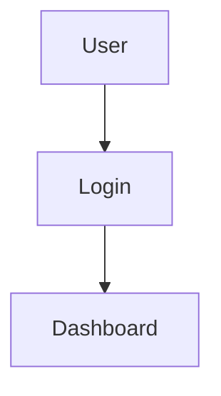

# 📥 Download

Thư mục `download/` chứa các file được sinh ra bởi NEXUS AI khi push lên GitHub.

> **Note:** Thư mục này trống trong repo. Khi bạn tạo project mới và push lên GitHub, các file được sinh ra sẽ nằm trong **GitHub repo** (không phải thư mục này).

## Files được push lên GitHub

Khi leader bấm **"Push to GitHub"** (tab Git & Repo), NEXUS AI tạo repo mới và push 15+ files:

```
your-repo/
├── README.md                          # Project README (sinh bởi Agent-06)
├── .gitignore                         # Node.js + Next.js + env
├── PROJECT_SUMMARY.md                 # Tổng hợp tất cả sections
├── FOLDER_STRUCTURE.txt               # Folder tree (sinh bởi Agent-04)
├── docs/
│   ├── CODING_CONVENTION.md           # Coding convention (Agent-06)
│   ├── API_STANDARD.md                # API standard (Agent-06)
│   ├── ARCHITECTURE.md                # Architecture description (Agent-04)
│   ├── DATABASE.md                    # DB schema tables (Agent-04)
│   ├── API_ENDPOINTS.md               # API endpoints list (Agent-04)
│   ├── SPRINT_PLAN.md                 # Sprint timeline (Agent-03)
│   ├── TEAM.md                        # Team assignments (Agent-02)
│   ├── TASKS.md                       # Full todolist (Task Generator)
│   └── UML/
│       ├── use-case.mmd               # Use Case diagram (Agent-05)
│       ├── class-diagram.mmd          # Class diagram (Agent-05)
│       ├── erd.mmd                     # ERD (Agent-05)
│       └── sequence.mmd               # Sequence diagram (Agent-05)
└── .github/
    └── ISSUE_TEMPLATE/
        └── task.md                    # Issue template (Agent-07)
```

## Cách download

### Method 1: Clone repo từ GitHub

```bash
git clone https://github.com/USERNAME/REPO-NAME.git
cd REPO-NAME
```

### Method 2: Download ZIP

1. Vào repo trên GitHub
2. Click **"Code"** → **"Download ZIP"**

### Method 3: Sử dụng NEXUS AI UI

1. Mở workspace → tab **Git & Repo**
2. Click **"Push to GitHub"** (nếu chưa push)
3. Click link repo URL → mở GitHub
4. Download từ GitHub

## File format

| File | Format | Mô tả |
|---|---|---|
| `*.md` | Markdown | Render trên GitHub |
| `*.mmd` | Mermaid | Render trên GitHub (mermaid diagram) |
| `*.txt` | Plain text | Folder tree |
| `.gitignore` | Git ignore | Node.js + Next.js + env patterns |

## Mermaid diagrams trên GitHub

GitHub tự render `.mmd` files trong markdown code blocks:

````markdown

````

Tuy nhiên, file `.mmd` độc lập cần wrap trong markdown để render. Copy content vào `README.md`:

````markdown
## Use Case Diagram

```mermaid
<content of use-case.mmd>
```
````

Hoặc test tại https://mermaid.live

---

[← Về README](../README.md)
